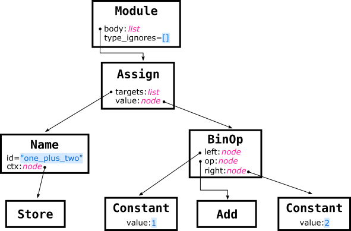

Title: Abstract Syntax Trees in Python
Date: 2021-02-20 10:30
Category: Concepts
Tags: ast, Mutpy, Syntax Tree, data structures, random, PyBites Platform, Jupyter notebook, IPython, typing, linters, mypy
Slug: ast-intro
Authors: Alessandro Finamore
summary: In this article Alessandro provides an overview of Abstract Syntax Trees (ASTs), introduces a few use-cases, and showcases the `ast` module in the Python Standard Library. The content is structured in a top-down fashion, starting from general notion about an AST, and digging deeper up to the point of artificially manipulating an AST to "randomize" the content of some instructions.
cover: images/featured/pb-guest.png

## Index 
* [What is an Abstract Syntax Tree (AST)?](#what-is-an-abstract-syntax-tree-ast)
* [The `ast` Python module and its use](#the-ast-python-module-and-its-use)
* [Using the `ast` module to investigate the PyBites Bite exercises](#using-the-ast-module-to-investigate-the-pybites-bite-exercises)
    * [`builtins` popularity](#builtins-popularity)
    * [Modules popularity](#modules-popularity)
* [Dissecting an assignment instruction using the `ast` module](#dissecting-an-assignment-instruction-using-the-ast-module)
    * [The `Module.type_ignores` attribute and type comments](#the-moduletype_ignores-attribute-and-type-comments)
* [The `ast` module APIs](#the-ast-module-apis)
    * [Visiting an AST](#visiting-an-ast)
    * [Modifying an AST](#modifying-an-ast)

> __Requirement__: All examples are compatible with at least Python v3.6, except for using `ast.dump()` with the attribute `indent=` which has been added in Python v3.9. 

<a name="what-is-an-abstract-syntax-tree-ast"></a>
## What is an Abstract Syntax Tree (AST)?

An Abstract Syntax Tree (AST) is a data structure used to reason about the grammar of a programming language in the context of the instructions provided into source code.


For instance, compilers use ASTs when transforming source code into binary code:

1. Given some text source code, the compiler first tokenizes the text to identify programming language keywords, variables, literals, etc. Each token represents an "atom" of an instruction.

2. Tokens are then rearranged into an AST, a tree where nodes are the "atoms" of the instructions, and edges the relationships between the atoms based on the programming language grammar. For instance, the AST make explicit the presence of a function call, the related input arguments, the instructions composing the function, etc.

3. The compiler then can apply multiple optimizations to the AST, and ultimately converts it into binary code.

Despite their role for compilers, ASTs are useful for a broader set of use-cases. Let's discuss this more in details.

<a name="the-ast-python-module-and-its-use"></a>
## The `ast` Python module and its use

The `ast` module in the Python standard library can be used to create, visit, and modify AST related to Python source code. It has been introduced in [Python 2.6](https://docs.python.org/release/2.6/whatsnew/2.6.html#the-ast-module), and since then it evolved alongside the Python grammar.

Even if it is part of standard library since a long time, it is not common to use it *directly*. Rather, you might have used it *indirectly* as popular tools use it under-the-hood:

- __code testing__: [`mutpy`](https://pypi.org/project/MutPy/) is a mutation testing tool used to alters the code under testing to broaden the set of tests in an automated fashion. In practice a mutation is an artificial modification of the AST generated from the code under testing. To see how PyBites uses `mutpy`, check out [this article](https://pybit.es/guest-mutpy-exploration.html).

- __code coverage__: [`vulture`](https://pypi.org/project/vulture/) is a static code analyzer that studies an AST to identify portion of the code not used.

- __code vulnerabilities__: [`bandit`](https://pypi.org/project/bandit/) uses the AST representation to identify security vulnerabilities.

- __code autocompletion__: [`jedi`](https://pypi.org/project/jedi/) is an IDE and text editors autocompletion tool relying on the `ast` module functionality to safely evaluate expressions.

- __code reformating__: [`black`](https://pypi.org/project/black/) and [`flake8`](https://pypi.org/project/flake8/) are two popular tools to enforce code reformatting, and they both use an AST representation of the source code to apply their formatting rules.

<a name="using-the-ast-module-to-investigate-the-pybites-bite-exercises"></a>
## Using the `ast` module to investigate the PyBites Bite exercises

Still not convinced of the relevance of an AST? Fair enough: let's consider a more practical, and closer to the PyBites Platform, use-case.

The [PyBites Platform](https://codechalleng.es/) is currently offering 300+ Bite exercises, and the number is constantly increasing. Given the (semi)hidden intention of the platform is to offer a varied set of challenges covering different Python modules and functionalities, it starts to be more and more challenging to identify what is covered by already available exercises, and what is instead left to explore.

This is where we can take advantage of the `ast` module. Specifically, we can process the source code of the solution of the exercises (as provided by the authors of the challenges) and recover some statistics about their content. For instance, which are the popular modules and builtin functions used.

Here some of the results. To follow along check out [this Jupyter notebook](https://github.com/pybites/notebooks/tree/main/ast-intro).

<a name="builtins-popularity"></a>
### Builtins popularity


The histogram above shows the Python builtin calls sorted by their popularity. In other words, using the `ast` module one can detect when a function call has been made, and if it relates to the `builtins` module or not. Three colors are used to visually distinguish between exception types, the creation of base types (`int`, `float`, `bool`, `list`, and `set`), or other functions. The histogram is a normalized frequency count, i.e., the frequency of each element is cumulated across all exercises, and divided by the sum of all elements occurrence across all exercises.

A few observations:

- The distribution is heavy tailed, with `len()` representing 13.4% of all builtin calls, while `dir()` being used only once. 

- All five base types are used, but `bool()` is used only in 1 challenge.

- Only 5 of the standard exceptions are used, with `ValueError` being the most common.

- Most of the builtin functions are already used by exercises, but considering the [functional programming calls](https://docs.python.org/3/howto/functional.html) you can notice that `map()` appears while `filter()` does not (as indeed the common practice is to prefer [list comprehension](https://realpython.com/list-comprehension-python/#profile-to-optimize-performance)).

<a name="modules-popularity"></a>
### Modules popularity


The histogram above shows the ranking for modules. For simplicity we limit to report on the root modules only. If submodules are used, their frequencies are cumulated into the frequency of the respective root modules.

As before, the histogram is heavy tailed, a testament that the PyBites Bite exercises try to "cover a little bit of everything".

We can observe the presence of non-standard modules, such as `pandas` and `pytest`, as well more ad-hoc modules such as as `zodiac` and `fibonacci` that are created for the purpose of the challenges themselves.

One can easily expand the analysis to understand the functions used in each module/submodule, as well as dive into more specific analysis. What is relevant to highlight is that the results reported here are generated with about 50 lines of Python code and using `ast` module. Processing the 300+ source code files with tools like [`awk`](https://www.gnu.org/software/gawk/manual/gawk.html), [`grep`](https://www.gnu.org/software/grep/), or anything else would have been significantly harder.

Hopefully this examples gave you a rough idea of what you can achieve with an AST. The next step is to understand how to create such data structures, and investigate their composition.

<a name="dissecting-an-assignment-instruction-using-the-ast-module"></a>
## Dissecting an assignment instruction using the `ast` module

To start familiarize with the `ast` module, let's see what happens when we analyze a single instruction: `one_plus_two = 1+2`

```
>>> import ast
>>> code = "one_plus_two = 1+2"
>>> tree = ast.parse(code)
>>> ast.dump(tree, indent=4)
```

This will output:

	:::console
	Module(
		body=[
			Assign(
				targets=[
					Name(id='one_plus_two', ctx=Store())],
				value=BinOp(
					left=Constant(value=1),
					op=Add(),
					right=Constant(value=2)))],
		type_ignores=[])

It might not be obvious at first, but the output generated by `ast.dump()` is actually a tree:

- The words starting with capital letter are nodes of the tree.

- The attributes of the nodes are either edges of the tree or metadata.

Let's rework the output into a diagram with the following conventions:

- One rectangle for each node, marking in bold the related node type.

- Node attributes collecting metadata are reported in blue.

- Other node attributes are annotated with their type.

- Nodes are connected based on their attributes.



With this visualization at hand we can observe a few things.

The root of the tree is a `Module` node. In fact, even if our example is a single line program, it is still a true Python module. The node contains two attributes `body` and `type_ignores`. Let's put the aside `type_ignores` for a moment and focus on `body`.

As a Python module contains a series of instructions, the `Module.body` attribute is a list of nodes, one for each instruction in the program. Our example consists of a single assignment operation, hence `Module.body` contains only one `Assign` node.

An assignment operation has a *right-hand side* specifying the *operation* to perform, and a *left-hand side* specifying the *destination* of the operation. The two sides are associated to the `Assign.value` and `Assign.targets` attributes of the `Assign` node.

Considering the right-hand side, the `Assign.value` attribute is a `BinOp` node, since the instruction is a binary operation between two operands, which is fully specified with three attributes: 

- `BinOp.op` is a `Add` node given we are performing an addition.

- `BinOp.left` and `BinOp.right` are the addition operands and consist of `Constant` nodes, each holding the raw value in the `Constant.value` attribute.

Considering the left-side, as Python supports multiple assignments and tuple unpacking, the `Assign.targets` attribute is a list collecting the different destinations of the operation. In our case the assignment is for a single variable, so a single `Name` node is used. In turn, the `Name` node has 2 attributes:

- `Name.id` stores the name of the variable used in the program (`"one_plus_two"`). 

- `Name.ctx` specifies how variable reference is used in the program. This can only be one of types `ast.Load`, `ast.Remove` or `ast.Store`, but those are always empty nodes. 

<a name="the-moduletype_ignores-attribute-and-type-comments"></a>
### The `Module.type_ignores` attribute and type comments

The attribute `Module.type_ignores` in the vast majority of the cases is going to be an empty list. This is why in the sketch is colored in blue. To understand why this is the case and what is the actual purpose of the attribute, we need to make a digression.

Python 3.0 introduced annotations, and few years later those have been expanded into type hints. If you are not familiar with those concepts, check this [Real Python tutorial](https://realpython.com/lessons/type-comments/) and the [official doc](https://docs.python.org/3/library/typing.html?highlight=typing#module-typing).

Those changes were not back ported to Python 2, which instead was using __type comments__ as a form of annotation. For more information, see [PEP 484](https://www.python.org/dev/peps/pep-0484/#type-comments) or this [Real Python tutorial](https://realpython.com/lessons/type-comments/).

The attribute `Module.type_ignores` refers to a special type comment `# type: ignore` that was used to indicate to type checker (such as [mypy](http://mypy-lang.org)) to suppress errors if one was found. For legacy reasons, the `ast` module is still reporting on those comments, but *only when asked* to do so.

Let's see an example.

```
>>> code = 'one_plus_two = 1+2 # type: int'
>>> tree = ast.parse(code, type_comments=True)
>>> print(ast.dump(tree, indent=4))
```

This will output:

	:::console
	Module(
		body=[
			Assign(
				targets=[
					Name(id='one_plus_two', ctx=Store())],
				value=BinOp(
					left=Constant(value=1),
					op=Add(),
					right=Constant(value=2)),
				type_comment='int')],
		type_ignores=[])

Notice that the only difference with respect to the detailed analysis of the AST previously discussed is the presence of the attribute `Assign.type_comment='int'`. The attribute reflects the metadata provided by type comment `# type: int`, and is added to the AST tree `Assign` node because we specified `type_comment=True` when triggering the parsing. 

However, `# type: ignore` is treated differently. Those type comments are stored into the `Module.type_ignores` attribute as `TypeIgnore` objects rather than being collected as metadata in the inner nodes of the tree.

```
>>> code = 'one_plus_two = 1+2 # type: ignore'
>>> tree = ast.parse(code, type_comments=True)
>>> print(ast.dump(tree, indent=4))
```

This will output:

	:::console
	Module(
		body=[
			Assign(
				targets=[
					Name(id='one_plus_two', ctx=Store())],
				value=BinOp(
					left=Constant(value=1),
					op=Add(),
					right=Constant(value=2)))],
		type_ignores=[
			TypeIgnore(lineno=1, tag='')])

<a name="the-ast-module-apis"></a>
## The `ast` module APIs

The `ast` module is mostly a large collection of classes, one for each of the different aspects of the Python grammar. Overall, there are about 100 classes, ranging from literals, to more complex construct such as list comprehensions.

`ast.AST` is the base class for all other classes in the module, and it defines the following base attributes for all AST nodes:

- `lineno`, `col_offset`, `end_lineno`, and `end_col_offset` are used to track the precise position of the related instruction in the source code.

- `_fields` contains the list of attribute names (you can think that is a list of "children" names).

When dealing with an AST the trickiest part is understanding nodes and attributes semantic. In fact, there are a lot of variants and corner cases, so it is easy to get confused.

A good way to start to familiarize with an AST is to use an interactive console such as [`ipython`](https://ipython.org) similarly to what we did in the previous examples. If you are used to an IDE, both [PyCharm](https://plugins.jetbrains.com/plugin/227-psiviewer) and [Visual Studio Code](https://marketplace.visualstudio.com/items?itemName=azeemba.python-ast-preview) provide plugins to visualize an AST (notice that PyCharm uses its own version of AST called [Program Structure Interface - PSI](https://plugins.jetbrains.com/docs/intellij/psi.html))

No matter your preferred choice, the documentation is a fundamental resource to keep at hand. Yet, a couple of remarks:

- Given that the Python language is in constant evolution, make sure to use the [most recent version of the Python doc](https://docs.python.org/3/library/ast.html?highlight=ast).

- The official documentation also suggests to consult [Green Tree Snake](https://greentreesnakes.readthedocs.io/), which indeed does a good job at complementing the official documentation on parts that that otherwise would seem "dry" of details.

Beside the classes, the `ast` module defines how to perform a visit of a tree, and how to do transformations.

<a name="visiting-an-ast"></a>
### Visiting an AST

You can visit an AST in two ways: using helper functions, or via an `ast.NodeVisitor` class.

Let's starts reviewing the helper functions:

- `ast.walk()` visit the specified node, and *recursively* all its descendant, but in a non specified order.

- `ast.iter_fields()` and `ast.iter_child_nodes()` are similar to `.items()` and `.keys()` of a `dict` data structure, but applied to a specific node only, and they are *not recursive.*

Here some examples:

```
>>> import ast
>>> code = "one_plus_two = 1+2"
>>> tree = ast.parse(code)

>>> for node in ast.walk(tree):
        print(node.__class__.__name__)

Module
Assign
Name
BinOp
Store
Constant
Add
Constant

>>> for name, value in ast.iter_fields(tree):
        print(name, value)
    
body [<_ast.Assign object at 0x10c60be80>]
type_ignores []

>>> for node in ast.iter_child_nodes(tree):
        print(node.__class__.__name__)

Assign
```

When using an `ast.NodeVisitor` instead, one can register specific callbacks to trigger when visiting specific node types:

```
class BinOpVisitor(ast.NodeVisitor):

    def visit_BinOp(self, node):
        print(f"found BinOp at line: {node.lineno}")
        self.generic_visit(node)
```

In this example: 

- We define a class `BinOpVisitor` extending the `ast.NodeVisitor`.

- We register a callback to be triggered when `ast.BinOp` nodes are visited. The name of callback is always `visit_XYZ` where `XYZ` is one of the predefined node types name (`BinOp` in our case).

- When the callback is invoked it receives the reference of the node under analysis. In this example we use the node info to print the line number of the instruction it relates to.

- Finally, we invoke `self.generic_visit(node)` to propagate the visit on the children of the input node.

What sort of *black magic* happens behind the scene to trigger the callbacks? It is actually simple.  A `ast.NodeVisitor` also defines a `visit()` function which is always invoked first: if the input node type matches one of the callbacks, such callback is called, otherwise `generic_visit()` is invoked to visit the node children. In our example we are not overwriting `visit()`, hence we can trigger a visit of the tree simply invoking the method:

```
>>> vis = BinOpVisitor()
>>> vis.visit(tree)
```


Here the complete example:

```
import ast

class BinOpVisitor(ast.NodeVisitor):

    def visit_BinOp(self, node):
        print(f"found BinOp at line: {node.lineno}")
        self.generic_visit(node)


code = """
left_op = 1
right_op = 2
sum_two_things = left_op + right_op
other_sum = sum_two_things - 1

print(sum_two_things)
print(other_sum)
"""

tree = ast.parse(code)

print("=== full AST ===")
print(ast.dump(tree, indent=4))

print()
print("=== visit ===")
vis = BinOpVisitor()
vis.visit(tree)
```

Running the program we obtain the following output:

	:::console
	=== full AST ===
	Module(
		body=[
			Assign(
				targets=[
					Name(id='left_op', ctx=Store())],
				value=Constant(value=1)),
			Assign(
				targets=[
					Name(id='right_op', ctx=Store())],
				value=Constant(value=2)),
			Assign(
				targets=[
					Name(id='sum_two_things', ctx=Store())],
				value=BinOp(
					left=Name(id='left_op', ctx=Load()),
					op=Add(),
					right=Name(id='right_op', ctx=Load()))),
			Assign(
				targets=[
					Name(id='other_sum', ctx=Store())],
				value=BinOp(
					left=Name(id='sum_two_things', ctx=Load()),
					op=Sub(),
					right=Constant(value=1))),
			Expr(
				value=Call(
					func=Name(id='print', ctx=Load()),
					args=[
						Name(id='sum_two_things', ctx=Load())],
					keywords=[])),
			Expr(
				value=Call(
					func=Name(id='print', ctx=Load()),
					args=[
						Name(id='other_sum', ctx=Load())],
					keywords=[]))],
		type_ignores=[])

	=== visit ===
	found BinOp at line: 4
	found BinOp at line: 5

<a name="modifying-an-ast"></a>
### Modifying an AST

A `ast.NodeTransformer` can be used as base class for a transformers, similarly to the logic used for the visitor class. This time, rather than simply visiting the nodes, the callbacks are used to modify, replace, add new nodes.

Here an example:

```
import ast
import random

class ConstantTransformer(ast.NodeTransformer):
    def visit_Constant(self, node):
        new_value = random.randint(-10, 10)
        new_node = ast.Constant(new_value)
        print(f"replacing constant {node.value} -> {new_value} at lineno: {node.lineno}")
        return new_node
```

In this example:

- We registered a callback to be triggered when handing a `ast.Constant` node.

- The callback generates a random number between (-10, 10), creates a new `ast.Constant()` node with the generated value, and reports a message on the standard output.

- Finally, it returns the reference of the new node.

The reference returned by the callbacks represent the node to use in the AST. In this example we are replacing the original node. When returning `None` instead, the visited node is removed from the tree.

To trigger the transformation, we use the same operation used for the visit. This time the visit returns the reference of the tree modified:

```
>>> vis = ConstantTransformer()
>>> new_tree = vis.visit(tree)
```

Here the full example:

```
import ast
import random

class ConstantTransformer(ast.NodeTransformer):
    def visit_Constant(self, node):
        new_value = random.randint(-10, 10)
        print(f"replacing constant {node.value} -> {new_value} at lineno: {node.lineno}")
        new_node = ast.Constant(new_value)
        return new_node

def exec_tree(tree):
    print()
    print("=== AST ===")
    print(ast.dump(tree, indent=4))
    print('---')

    tree_fixed = ast.fix_missing_locations(tree)
    code_obj = compile(tree_fixed, '<string>', 'exec')
    exec(code_obj)

code = """
left_op = 1
right_op = 2
sum_two_things = left_op + right_op
other_sum = sum_two_things - 1

print(sum_two_things)
print(other_sum)
"""

tree = ast.parse(code)
exec_tree(tree)

## fix seed
random.seed(10)

## apply the transformations
vis = ConstantTransformer()
new_tree = vis.visit(tree)

```

The source code in `code` is the same as the one used to do a simple visit. Likewise, the process to generate the related tree.

Then we fix a seed for the random number generator via `random.seed()`, so to have consistent output when running the program multiple times.

We create a `ConstantTransformer()` object, and we visit it obtaining `new_tree`, which is a transformed version of the original tree.

To verify the transformations, we can print the AST, and "run it" by transforming into executable code. To do so, we use the helper function `exec_tree()`:

- We start printing the content of the tree using `ast.dump()` as seen in previous examples.

- We then apply `ast.fix_missing_locations()` to the tree. Each node in the AST is indeed expected to have `lineno` filled, but rather than filling it when doing the transformations, the helper function `ast.fix_missing_locations()` allows to delay this fix until the compilation is required.

- Finally, the builtin function `compile()` is used to transform the AST to a code object, which in turn is executed calling the builtin `exec()`.

Here the output related to `exec_tree(tree)`:

	:::console
	=== AST ===
	Module(
		body=[
			Assign(
				targets=[
					Name(id='left_op', ctx=Store())],
				value=Constant(value=1)),
			Assign(
				targets=[
					Name(id='right_op', ctx=Store())],
				value=Constant(value=2)),
			Assign(
				targets=[
					Name(id='sum_two_things', ctx=Store())],
				value=BinOp(
					left=Name(id='left_op', ctx=Load()),
					op=Add(),
					right=Name(id='right_op', ctx=Load()))),
			Assign(
				targets=[
					Name(id='other_sum', ctx=Store())],
				value=BinOp(
					left=Name(id='sum_two_things', ctx=Load()),
					op=Sub(),
					right=Constant(value=1))),
			Expr(
				value=Call(
					func=Name(id='print', ctx=Load()),
					args=[
						Name(id='sum_two_things', ctx=Load())],
					keywords=[])),
			Expr(
				value=Call(
					func=Name(id='print', ctx=Load()),
					args=[
						Name(id='other_sum', ctx=Load())],
					keywords=[]))],
		type_ignores=[])
	---
	3
	2

The output for `exec_tree(new_tree)`:

	:::console
	replacing constant 1 -> 8 at lineno: 2
	replacing constant 2 -> -9 at lineno: 3
	replacing constant 1 -> 3 at lineno: 5

	=== AST ===
	Module(
		body=[
			Assign(
				targets=[
					Name(id='left_op', ctx=Store())],
				value=Constant(value=8)),
			Assign(
				targets=[
					Name(id='right_op', ctx=Store())],
				value=Constant(value=-9)),
			Assign(
				targets=[
					Name(id='sum_two_things', ctx=Store())],
				value=BinOp(
					left=Name(id='left_op', ctx=Load()),
					op=Add(),
					right=Name(id='right_op', ctx=Load()))),
			Assign(
				targets=[
					Name(id='other_sum', ctx=Store())],
				value=BinOp(
					left=Name(id='sum_two_things', ctx=Load()),
					op=Sub(),
					right=Constant(value=3))),
			Expr(
				value=Call(
					func=Name(id='print', ctx=Load()),
					args=[
						Name(id='sum_two_things', ctx=Load())],
					keywords=[])),
			Expr(
				value=Call(
					func=Name(id='print', ctx=Load()),
					args=[
						Name(id='other_sum', ctx=Load())],
					keywords=[]))],
		type_ignores=[])
	---
	-1
	-4

The output now is "randomized", as expected by the transformation. However, the transformation has overwritten the original tree, as `new_tree` and `tree` are the same object.

```
>>> id(tree), id(new_tree)
4350659920, 4350659920
```

To avoid this however one simply use the [`copy` module](https://docs.python.org/3.9/library/copy.html?highlight=deepcopy#copy.deepcopy) to clone the whole tree before triggering the transformation, or overwrite the `visit()` method and define the ad-hoc logic for the use-case at hand.

Keep calm and happy Python coding!

-- [Alessandro](pages/guests.html#alessandrofinamore)
