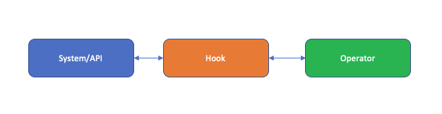
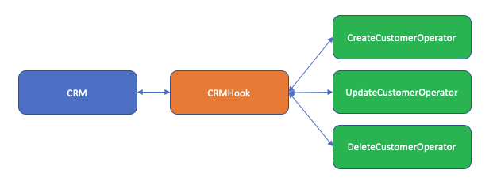

Title: Introduction to Building Custom Apache Airflow Operators
Date: 2020-04-10 22:55
Category: Data
Tags: Apache, Airflow, data
Slug: introduction-airflow
Authors: Christo Olivier
Illustration: airballoon.jpg
summary: If you work in data engineering, then the chance are high that you are using or have used Apache Airflow.
cover: images/featured/pb-guest.png

If you work in data engineering, then the chance are high that you are using or have used Apache Airflow.

This orchestration tool has become a firm favourite of many organisations. It was chosen by Google when they were looking at an orchestration tool to include in their cloud offering [Google Cloud Composer.](https://cloud.google.com/composer/)

Airflow comes with a ton of operators out of the box and even more community supplied ones. However, chances are that at some point you might think "it would be really great if I could have my own operator to do X".

This post is to help give you a starting point for building you own custom Airflow operators in a structured and scalable way via [Airflow plugins.](https://airflow.apache.org/docs/stable/plugins.html)

## Why extend via a plugin

There are mainly three options available to you when you run into a situation for which an existing [Operator](https://airflow.apache.org/docs/stable/concepts.html#tasks) is not available:

1. Write a custom Python function and call it via the PythonOperator.
2. Call a Python application or external application via the BashOperator.
3. Create a custom Operator that performs the functionality you require.

Of the three methods only option 3 integrates into Airflow's core. It allows you to make use of all of the functionality Airflow provides.

You will be able to remove your operator's logic from the code that defines your [DAG,](https://airflow.apache.org/docs/stable/concepts.html#dags) ensuring you do not mix the logic of your data pipeline with the logic of the components that form its building blocks.

Finally, it allows you to create a redistributable component that can be used by all of the Airflow instances across your organisation.
___

## Logical components of a custom operator plugin

The Airflow documentation for [plugins](https://airflow.apache.org/docs/stable/plugins.html) show that they can be used to do all sorts of customisation of Airflow. We will only be focusing on using them to build custom operators that you can then use as Tasks in your DAGs.

The two main parts of a custom operator is the Hook and the Operator.

### Hook

A _Hook_ contains the logic required to perform actions against an API, service or interface of some system.

It should not contain the logic of the operator itself but should expose methods that will then be used by the Operator in order to perform the actions it requires against the API, service or sustem interface that the operator is targeting.

### Operator

An _Operator_ contains all of the "business" logic of what will be a Task in one of your DAGs. This is the logic that deals with how your Task will behave and what actions it will perform.

It should never communicate with the service, API or system interface directly but should always do that through the _hook_.

Below is a simple diagram of the logical components.



By keeping the logic separated into these two components you will be able to build multiple Operators that all use the same Hook without duplicating the code needed to interact with the source system.

Here is an example of what that would mean for a fictitious CRM plugin.



___

## The code structure for your plugin

If you have looked at the Airflow documentation you will see that there are two options structuring your code.

1. The first option is to simply create a python module that contains all of the objects.
2. The second option is to create a python package that contains modules and/or sub packages for the different objects.

My personal preference is to use a python package for plugins. It allows me to separate the objects neatly into their own files and folders. This makes it easier to extend the plugin in future and also keeps the code neat and tidy.

The Airflow documentation has a short section on creating plugins via a Python package. It specifies that you need to use the `setuptools entrypoint` system. This is not the only way. I prefer to use a simple Python package approach where the package folder gets copied to the Airflow `plugins` folder, just like you would if you used the single module approach.

The folder structures I normally use depend on whether the plugin is simple or complex.

The simple layout would look like this.

```bash
<PROJECT NAME>/<PLUGIN NAME>/__init__.py
<PROJECT NAME>/<PLUGIN NAME>/<some_new>_hook.py
<PROJECT NAME>/<PLUGIN NAME>/<some_new>_operator.py
```

The complex layout would look like this.

```bash
<PROJECT NAME>/<PLUGIN NAME>/__init__.py
<PROJECT NAME>/<PLUGIN NAME>/hooks/__init__.py
<PROJECT NAME>/<PLUGIN NAME>/hooks/<some_new>_hook.py
<PROJECT NAME>/<PLUGIN NAME>/operators/__init__.py
<PROJECT NAME>/<PLUGIN NAME>/operators/<some_new>_operator.py
<PROJECT NAME>/<PLUGIN NAME>/operators/<another_new>_operator.py
```

So, for our fictitious CRM example the simple folder structure would look something like this.

```bash
CRMProject/crm_plugin/__init__.py
CRMProject/crm_plugin/crm_hook.py
CRMProject/crm_plugin/customer_operator.py
```

While the complex folder structure would look like this.

```bash
CRMProject/crm_plugin/__init__.py
CRMProject/crm_plugin/hooks/__init__.py
CRMProject/crm_plugin/hooks/crm_hook.py
CRMProject/crm_plugin/operators/__init__.py
CRMProject/crm_plugin/operators/customer_operator.py
CRMProject/crm_plugin/operators/sync_operator.py
```

How do you decide between the two layout structures? I normally base that on the complexity of the package. The complexity comes down to the number of hooks and operators that it will contain and if they can be logically separated in some way, such as by the function they will perform.

An example of a complex plugin would be if our CRM package contained operators for manipulating customers in the CRM system as well as operators for synchronizing the CRM system with a billing or other finance system.

The moment you feel that it becomes difficult to manage the amount of code for your plugin then it might be time to consider the complex layout.

Next let's look at the different Python objects that you will need to create.

## The code of your plugin

All plugins must have a class that derives from the `airflow.plugins_manager.AirflowPlugin` class. This class references all of the objects you create and want to plug into Airflow. Without this class you simply will not have a plugin.

You futher need classes for each of your hooks and operators.

Hooks need to be derived from either the base hook class `airflow.hooks.base_hook.BaseHook` or one of the existing hooks that are built into airflow such as `airflow.hooks.dbapi_hook.DbApiHook`.

Operators similarly need to derive at the very least from the base operator `airflow.operators.BaseOperator` class or one of the existing operator classes distributed with airflow such as `airflow.operators.bash_operator.BashOperator`.

Keep in mind that you do not need to create your own hook in your plugin if one already exists that will fullfil your purpose. For example, if you are building custom operators for a control database running on Postgresql you can simply create your operators using the PostgresHook. There is no need in that instance to create your own hook to operate against Postgresql.

Now that we have covered the code required by our plugin let's look at where these classes will be in our project structure and what they will contain.

### AirflowPlugin class

Our `AirflowPlugin` derived class will be placed in the `<PROJECT NAME>/<PLUGIN NAME>/__init__.py` file. Below is the content of the class for our fictitious CRM example.

#### Simple layout

```python
# CRMProject/crm_plugin/__init__.py
from airflow.plugins_manager import AirflowPlugin
from crm_plugin.crm_hook import CrmHook
from crm_plugin.customer_operator import CreateCustomerOperator, DeleteCustomerOperator, UpdateCustomerOperator


class AirflowCrmPlugin(AirflowPlugin):
    name = "crm_plugin"  # does not need to match the package name
    operators = [CreateCustomerOperator, DeleteCustomerOperator, UpdateCustomerOperator]
    sensors = []
    hooks = [CrmHook]
    executors = []
    macros = []
    admin_views = []
    flask_blueprints = []
    menu_links = []
    appbuilder_views = []
    appbuilder_menu_items = []
    global_operator_extra_links = []
    operator_extra_links = []
```

#### Complex layout

```python
# CRMProject/crm_plugin/__init__.py
from airflow.plugins_manager import AirflowPlugin
from crm_plugin.hooks.crm_hook import CrmHook
from crm_plugin.operators.customer_operator import CreateCustomerOperator, DeleteCustomerOperator, UpdateCustomerOperator
from crm_plugin.operators.sync_operator import SyncCrmToBillingOperator


class AirflowCrmPlugin(AirflowPlugin):
    name = "crm_plugin"  # does not need to match the package name
    operators = [CreateCustomerOperator, DeleteCustomerOperator, UpdateCustomerOperator, SyncCrmToBillingOperator]
    sensors = []
    hooks = [CrmHook]
    executors = []
    macros = []
    admin_views = []
    flask_blueprints = []
    menu_links = []
    appbuilder_views = []
    appbuilder_menu_items = []
    global_operator_extra_links = []
    operator_extra_links = []
```

Note the comment in both examples for the `name` attribute. The value of this attribute creates the namespace you will reference in your Airflow DAGs when importing the operators and hooks. It does not need to match the name of your package. I prefer to give it the same name as the package. This avoids any confusion when you receive errors in Airflow which would show the namespace instead of the package name in the stack trace. 

We will get into more detail about importing our operators and hooks in a later section.

### Hook class(es)

Our `Hook` derived class will be stored in either the `<PROJECT NAME>/<PLUGIN NAME>/<some_new>_hook.py` module or the `<PROJECT NAME>/<PLUGIN NAME>/hooks/<some_new>_hook.py` module of the `hooks` sub-package. The code of the hook will not differ between the simple and complex layout.

There are no required methods that your hook must implement. What it should do is provide a consitent set of methods that allow your operators to interact with the system or API it provides access to. An example of what our CRM hook could look like is presented below.

```python
from airflow.hooks.base_hook import BaseHook
from airflow.exceptions import AirflowException
from crm_sdk import crm_api  # import external libraries to interact with target system


class CrmHook(BaseHook):
    """
    Hook to interact with the ACME CRM System.
    """

    def __init__(self, ...):
        # your code goes here

    def insert_object(self, ...):
        """
        Insert an object into the CRM system
        """
        # your code goes here

    def update_object(self, ...):
        """
        Update an object into the CRM system
        """
        # your code goes here

    def delete_object(self, ...):
        """
        Delete an object into the CRM system
        """
        # your code goes here

    def extract_object(self, ...):
        """
        Extract an object into the CRM system
        """
        # your code goes here

```

Try and keep these methods to low level operations which can be combined in your operators to perform their higher-level functionality. Your hook should allow you to build multiple operators out of the methods it provides.

### Operator class(es)

Our `Operator` derived classes will be stored either in the `<PROJECT NAME>/<PLUGIN NAME>/<some_new>_operator.py` module or the `<PROJECT NAME>/<PLUGIN NAME>/operators/<some_new>_operator.py` and `<PROJECT NAME>/<PLUGIN NAME>/operators/<another_new>_operator.py` modules of the `operators` sub-package. The code of the operators will not differ much between the simple and complex layout. The only difference would be the importing of the hook from the `hooks` sub-package in the complex layout or the `hooks` module in the simple layout.

Operators require that you implement an `execute` method. This is the entry point into your operator for Airflow and it is called when the task in your DAG executes. The `execute` method also takes the `context` parameter as the first positional parameter after `self`. This allows the method to receive the execution context in which the task instance of the operator is executed in. This is useful when you want your operator to be able to make use of things such as xcoms.

The `apply_defaults` decorator wraps the `__init__` method of the class which applies the DAG defaults, set in your DAG script, to the task instance of your operator at run time.

There are also two important class attributes that we can set. These are `templated_fields` and `template_ext`. These two attributes are iterables that should contain the string values for the fields and/or file extensions that will allow templating with the jinja templating support in Airflow. More information on the templating support is available in the documentation [here](https://airflow.apache.org/docs/stable/concepts.html#jinja-templating) and [here](https://airflow.apache.org/docs/stable/macros.html).

An example of what one of our operator classes could look like is shown below.

```python
from airflow.exceptions import AirflowException
from airflow.operators import BaseOperator
from airflow.utils.decorators import apply_defauls

from crm_plugin.crm_hook import CrmHook


class CreateCustomerOperator(BaseOperator):
    """
    This operator creates a new customer in the ACME CRM System.
    """
    template_fields = ['first_contact_date', 'bulk_file']
    template_ext = ['.csv']

    @apply_defaults
    def __init__(self, first_contact_date, bulk_file, ...):
        # your code goes here

    def _customer_exist(self, ...):
        """
        Helper method to check if a customer exist. Raises an exception if it does.
        """
        # your code goes here

    def execute(self, context):
        """
        Create a new customer in the CRM system.
        """
        # your code goes here
```

You can create as many methods in your class as you need in order to simplify you `execute` method. The same principles for good class design still counts here.

One word of warning for operator classes is to avoid making any calls out to a service via a hook or any other code in the constructor of the class. Airflow scans the DAG folder periodically to load new DAG files and refresh existing ones. When this process runs the constructor of your operator classes are called for each task in each DAG file. You will thus be making unnecessary calls to those services which could fail or cause a slowdown of this refresh process.

Instead rather create an empty attribute in the constructor which you then set to the object instance you require during the execution of the `execute` method. Below is an example of instantiating our hook in this way.

```python
class CreateCustomerOperator(BaseOperator):
    """
    This operator creates a new customer in the ACME CRM System.
    """
    template_fields = ['first_contact_date', 'bulk_file']
    template_ext = ['.csv']

    @apply_defaults
    def __init__(self, first_contact_date, bulk_file, ...):
        self.hook = None
        # your code goes here

    def _customer_exist(self, ...):
        """
        Helper method to check if a customer exists. Raises an exception if it does.
        """
        # your code goes here

    def execute(self, context):
        """
        Create a new customer in the CRM system.
        """
        if not self.hook:
            self.hook = CrmHook()
        # your code goes here
```

___

## Deploying and using your plugin

Once you have completed work on your plugin all that is left for you to do is to copy your `<PLUGIN NAME>` package folder to the Airflow `plugins` folder. Airflow will pick the plugin up and it will become available to your DAGs.

The location of the Airflow `plugins` folder can vary based on the configuration of your deployment. You can find the location by looking at the `plugins_folder` property in your deployment's configuration file or via the _configuration_ view in the Airflow front end.

If we copied the simple CRM plugin to our `plugins_folder` the folder structure would look like this.

```bash
<plugins_folder>/crm_plugin/__init__.py
<plugins_folder>/crm_plugin/crm_hook.py
<plugins_folder>/crm_plugin/customer_operator.py
```

In order to use your new plugin you will simply import your Operators and Hooks using the following statements.

```python
from airflow.hooks.<AIRFLOWPLUGIN NAME ATTRIBUTE VALUE> import <HOOKClass>
from airflow.operators.<AIRFLOWPLUGIN NAME ATTRIBUTE VALUE> import <OperatorClass>
```

Remember that value given to the `name` property of your `AirflowPlugin` derived class? We mentioned earlier that it will create the namespace from which we would need to import our classes. Our CRM example would thus look as follows.

```python
from airflow.hooks.crm_plugin import CrmHook
from airflow.operators.crm_plugin import CreateCustomerOperator, DeleteCustomerOperator, UpdateCustomerOperator
```

If we gave it a different value, say "acme_crm_plugin" then our imports would need to look like this.

```python
from airflow.hooks.acme_crm_plugin import CrmHook
from airflow.operators.acme_crm_plugin import CreateCustomerOperator, DeleteCustomerOperator, UpdateCustomerOperator
```

I mentioned previously that I avoid providing a value different to my package name to the `name` attribute. This is simply to avoid any confusion when you receive errors in Airflow and want to get to the correct code to fix based on a stack trace. Adding in unnecessary complexity is never a good thing from my experience. So try and keep thing as straight forward as possible with your plugins and the namespaces they will have once deployed.

___

## Wrap-up

This post has touched on a lot of things, all of which will help you when starting out developing plugins for Apache Airflow.

As with any technology there are many additional topics that we can go into more detail on. We have not looked in detail at the code that we can write in our classes or how we can go about creating tests for our plugins. We will leave those for future posts.

The Airflow documentation is a great resource to gain additional knowledge. However, I have found looking at the source code for the many operators and hooks that are included with Airflow an invaluable education. This is the beauty of open source tools; you have all of the code available to you to investigate and learn from. When in doubt, peak under the hood and see how the magic is created!


-- [Christo](pages/guests.html#christoolivier)

(Cover photo by Thomas Griggs on Unsplash)
