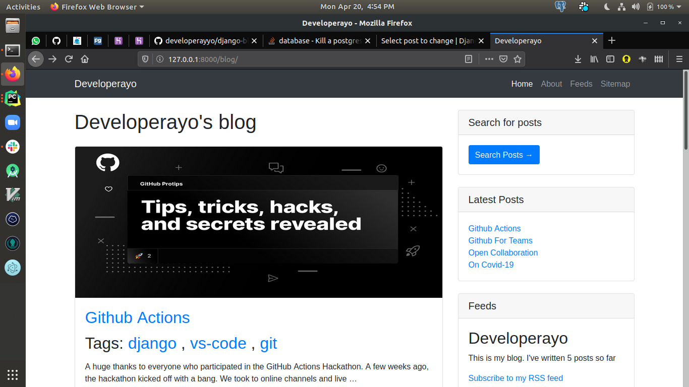

Title: a Django Blog From Scratch (
Date: 2020-04-21 9:35
Category: Django
Tags: guest, django, pybites, challenges, tutorial paralysis, blogging, Heroku
Slug: creating-django-blog
Authors: Peter Babalola
Illustration: dont-give-up.jpg
summary: Have you ever wanted to create awesome stuff with Django like making your own blog or any other app but don't know where to start? Or are you tired of taking lazy tutorials?

(Photo by Rosie Kerr on Unsplash)

Have you ever wanted to create awesome stuff with Django like making your own blog or any other app but don't know where to start? Or are you tired of taking lazy tutorials?

I found myself in the same situation but all it really takes is to [get started with Pybites challenges](https://codechalleng.es/challenges/), Stackoverflow and Github.  

## My story

I've been "learning" and "programming" in Python for a while now, but I still find it very difficult to build projects.

I've always wanted to build because I think that I don't have enough knowledge and experience to make them happen.

I've learned enough to be able to help others in my school and workplace from time to time, but I still get distracted by the next shiny package I hear about on a podcast or twitter.

## What changed

Fortunately I saw [Pybites' challenge post](https://twitter.com/pybites/status/1249635354736541697).

When I looked at it, I thought this challenge was tough, but I was determined to give it a try.

Today I can't believe I solved the challenge even beyond the scope of what was asked.

For the challenge I created a [Django blog](https://github.com/developerayyo/django-blog), which you can modify to your taste. I believe it's a great way to start your django journey.

The main piont here is: you need to get started, persist through, and work with what other developers have created, contributing back to open source.

Do those things and you will be among the best developer out there. 

## Lessons learned

I learned that it's one thing to build a Django app locally, it's another thing to be able to successfully deploy it for production.

I also learned the basics of the bootstrap framework.

Some challenges I faced:

- Serve my static and media files through amazone S3.

- I'm not really a fan of frontend development, so I had a difficult time setting up my template views and making them responsive.

- Using CLI to interact with my S3 bucket.

- Setting up the PostgreSQL database.

- Deployment to Heroku (you can check it out [here](https://devayo.herokuapp.com/blog/)).

This project itself was a real challenge for me!

## Overcoming these challenges

I overcame these challenges through a lot of research online and patience.

My passion for solving problems and building solutions made me persist through.



## Blog features

As you can see I had quite a lot of fun:

- Admin Interface

- Customized model managers

- Pagination

- Share posts by email

- Native comment system

- Tagging functionality

- Similar posts retrieval

- Custom templates tags and filter

- Sitemap functionality (XML)

- Blog post feed (XML)

- Full text search postgresql functionality

## Installation

1. Clone this project on your machine from Github [here](https://github.com/developerayyo/django-blog) 

2. `cd` into the project directory

3. Create a virtual environment: `python3 -m venv myvenv`

4. Activate myvenv `source myvenv/bin/activate`

5. Install requirements `pip3 install -r requirements.txt`

6. Run `python manage.py makemigrations`

7. Run `python manage.py migrate`

8. Create a superuser for admin access: `python manage.py createsuperuser`

9. Finally run `python manage.py runserver` and navigate to localhost:8000

**Note**

To use the full text search postgresql functionality, you must have postgresql
installed on your system and change your default project database settings in 
`settings.py`:

from: 
```
DATABASES = {
    'default': {
        'ENGINE': 'django.db.backends.sqlite3',
        'NAME': os.path.join(BASE_DIR, 'db.sqlite3'),
    }
}
```

to:
```
DATABASES = {
    'default': {
        'ENGINE': 'django.db.backends.postgresql',
        'NAME': '<your_db_name>',
        'USER': '<postgresql_user>',
        'PASSWORD': '<your_db_password>',
    }
}

```

Keep calm and code in Python!

-- [Peter Babalola](pages/guests.html#peterbabalola)
