Title: Naughts and Crosses gets a little help Date: 12 February 2021 Category: Concepts Tags: guest, games theory, ai,
tic-tac-toe, python Slug: guest-naughts-and-crosses Authors: Geoff Riley summary: Naughts and Crosses (Tic-Tac-Toe to
some audiences) is a popular skill game often played by children. It can also be usefully employed to distract dial up
computers, at NORAD for example, rather than allowing the 'playing' of Global Thermonuclear War. Would you like to play
a game? cover: images/featured/pb-guest.png

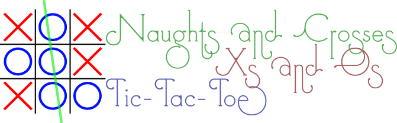
<!-- Indexes are always a good start! -->

## Index

* [Introduction](#introduction)
    * [Game concept](#game-concept)
* [Basic game implementation](#basic-game-implementation)
    * [Starting the code](#starting-the-code)
    * [The main class](#the-main-class)
    * [Who's the winner?](#whos-the-winner)
* [Let's play](#lets-play)
* [I always lose playing against myself](#i-always-lose-playing-against-myself)
    * [It's your move machine!](#its-your-move-machine)
* [References](#references)

<a name="introduction"></a>
## Introduction

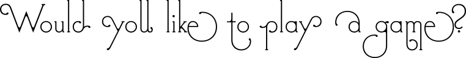
_([Wargames (1983)](https://www.imdb.com/title/tt0086567/))_

If you happen to have recently hacked into [NORAD (North American Aerospace Defense Command)](https://www.norad.mil/)
then it is quite possible that you are stuck in the 1980s and are looking to play **Global Thermonuclear War** 
_([Wargames (1983)](https://www.imdb.com/title/tt0086567/))_,
take it from me: it really won't turn out hope you hope.

On the other hand if you are looking for what is arguably the simplest of all strategy games, then you've come to the
right place. This article was inspired by the [_PyBites Coding Challenge 12_—**Build a Tic-tac-toe Game**](https://codechalleng.es/challenges/12/).

<a name="game-concept"></a>
### Game concept

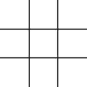

Traditionally, naughts and crosses _([Wikipedia article on Tic-tac-toe](https://en.wikipedia.org/wiki/Tic-tac-toe))_ is a pencil and paper game for two players: one playing the symbol 'O',
pronounced 'naught' or 'oh', and the other playing 'X', pronounced 'cross' or 'ex'. The game begins with a 3x3 grid of
nine cells, and the players take turns at drawing their symbols into one of the empty cells. The aim is to achieve the
occupation of three cells in a row, horizontally, vertically or diagonally, with their own symbol, whilst _at the same
time_ interfering with their opponents attempts to do likewise. There are eight possible winning lines are shown in the
figure below.


<a name="basic-game-implementation"></a>
## Basic game implementation

The first thing that is necessary in implementing _any_ game is deciding how it should be represented both to the player
and when it is held in the computer memory. We are working with fixed a three by three grid in this game, so it is easy
to see that a series of nine consecutive elements of an array can be used. Like this:

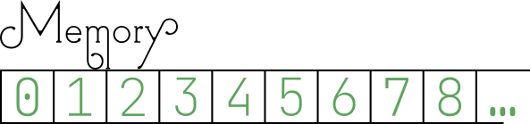

These memory cells, in turn, map to the three rows of three cells that will be displayed to the player. To help the
player to associate the positions of the cells, however, it is convenient to give a different _external_ mapping that is
based upon something familiar. A familiar three by three grid is found on the keyboard numeric keypad, but this is
'upside down' compared to how we have suggested the internal representation will be achieved.

This difference in representation can be handled in a few different ways:

* change the internal representation to match the external representation;
* change the external representation to match the internal representation; or
* find a way to translate between the two representations as and when needed.

There are implications for each of these options. Firstly, if the internal representation is changed, it wil be
necessary to extract the details for the grid when it is being displayed in a non-sequential order. This is not an
impossible situation, but adds a layer of complexity that is probably undesirable. Secondly, if the external
representation is changed, then it inconveniences the player who will have to think more about the value of the cell
rather than the position. Thirdly, and finally, translating between the two systems allows the positives of both
representations to be exercised with a minor inconvenience of ensuring that the interface between the two sides is
patrolled appropriately.

Assuming that the third option is taken we have the following representations:

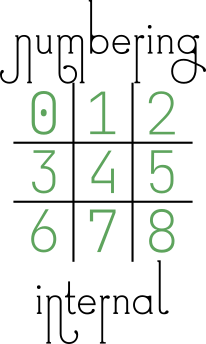
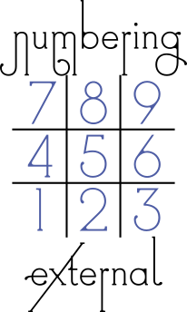

<a name='starting-the-code'></a>
### Starting the code

It is always wise to start off a Python file with a descriptive comment about the file, who wrote it, any copyright
declarations, the place within a project that it belongs and what the weather is like when you write the code, possibly
less likely on that last one. So, we begin our project and, as it is going to be a single file, just comment on what the
whole project is about. If this was to be a one of a number of files then the description would focus upon the
functionality of this particular file.
```python
"""
    Proper name: 'Naughts and Crosses'
    Irish name: 'Xs and Os'
    American name: 'Tic Tac Toe'
    Reason: Who on Earth has a clue?  It's an historical thing.
"""
```
Lovely. That'll do nicely. Not much coding going on there though. There are going to be some `import`s of various
modules to help us with the coding, straight off the bat we know that we are going to be dealing with some kind of
memory cells, this brings to mind that we'll need coding hints for things like `List` and perhaps `Union` so we'll add
those in for a starter. Later on we'll add more in at this place in the file.
```python
from typing import List, Union
```
There are a number of elements of the game that can be usefully given names to help to document the code as we go along.
The extra advantage to defining things by name at this point is that if we want to change things later on, then any
changes made here automatically reflect through the whole code. (Hurrah!)

So, what elements need to be defined? We have already identified that there are internal and external representations
involved, therefore those should be defined along with the mapping between the two. Externally we know that we're going
to have 'O' and 'X' to show the symbols—that much is obvious—but there is a third symbol too: the blank. The blank could
be just a space character, but that isn't very _visible_ if you want to **see** the grid, particular when it is empty,
but also when working out which row and column a single symbol might be on. For this reason we'll use the
underscore ('_') to represent a blank space.
```python
# External representations of the playing symbols 
BLANK_SYM: str = '_'
O_SYM: str = 'O'
X_SYM: str = 'X'
```
That will make any grids clear:
```text
 ___     _X_     ___
 ___     ___     _O_
 ___     ___     ___
Blank / One X / One O
```
What about internal representations? Does it matter? We could use the same symbols, however we _do_ know that string
comparisons are slower than integer comparisons, and so it would probably be better to use the quicker of the two given
that there are a lot of comparisons that will be made. Let us keep it simple and just use the values zero to two.
```python
# Internal representations of the playing symbols 
BLANK_VALUE: int = 0
O_VALUE: int = 1
X_VALUE: int = 2
```
Now that we have those defined, we can create a couple of dictionaries that map between the two systems:
```python
# Translation between systems
VAL_TO_SYM: dict = {
    BLANK_VALUE: BLANK_SYM,
    O_VALUE: O_SYM,
    X_VALUE: X_SYM,
}
SYM_TO_VAL: dict = {
    BLANK_SYM: BLANK_VALUE,
    O_SYM: O_VALUE,
    X_SYM: X_VALUE,
}
```
The chances are that whilst we are going through checking for winning lines and such like, we might want a quick way to
refer to the opponent of the current player; we might not need it, but it could prove useful:
```python
OPPONENT: dict = {
    O_VALUE: X_VALUE,
    X_VALUE: O_VALUE,
}
```
Just a couple of other things that need to be taken care of: the translation of internal to external grid positions, and
vise versa. Looking at the graphical images of the two representations, it is easy to write out a couple of dictionary
constants mapping between the two:

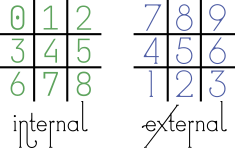

```python
INTERNAL_TO_EXTERNAL: dict = {
    0: 7, 1: 8, 2: 9,
    3: 4, 4: 5, 5: 6,
    6: 1, 7: 2, 8: 3
}
EXTERNAL_TO_INTERNAL: dict = {
    7: 0, 8: 1, 9: 2,
    4: 3, 5: 4, 6: 5,
    1: 6, 2: 7, 3: 8
}
```
In order to help validate the player input we'll create a list of valid positions for their pieces, remember that
`range()` returns value that _includes_ the first parameter, but _excludes_ the second parameter:
```python
VALID_POSITIONS: Set[int] = set(range(1, 10))
```
I originally created this as a `list` but realised later that it was better (essentially more efficient) as a `set` so
it is necessary to add `Set` to the `from typing import` line

Oh, and of course we need a list of winning combinations so that it is quick to check. It is convenient to specify a
winning line as a tuple of three integers, so here we have a list of (tuples of (three integers)): ah, `Tuple`, that's
another item to import from the `typing` module. The winning lines are describing the _internal_ numbering as per this
diagram:


```python
# A winning combination exists for three symbols in a row:
WINNING_COMBINATIONS: List[Tuple[int, int, int]] = [
    (0, 1, 2), (3, 4, 5), (6, 7, 8),
    (0, 3, 6), (1, 4, 7), (2, 5, 8),
    (0, 4, 8), (2, 4, 6),
]
```

<a name='the-main-class'></a>
### The main class

Class. Yes, this game is going to be encompassed within an object!  We can start getting into the nitty gritty right off
by declaring our class… in deference to our US cousins we'll call our class `TicTacToe`—it's both shorter than
`NaughtsAndCrosses` and less likely to cause argument over 'Nau…' versus 'Nou…' _([Naught vs. Nought](https://www.grammar.com/naught_vs._nought))_.

At the start of the class we'll define a few variables that are going to be useful throughout the game code, and define
the types that we're expecting them to hold:
```python
class TicTacToe:
    # define the types of various internal variables
    _board: List[int]
    _turn: int
    _turn_cycle: Iterator[int]
    _move: int
```
Going through these:

* `_board`: this will hold the current _internal_ representation of the playing area;
* `_turn`: keeping track of whose turn it is will be very necessary, this should only ever be `O_VALUE` or `X_VALUE`;
* `_turn_cycle`: a useful iterator object that returns an endless sequence of `O_VALUE`, `X_VALUE`, `O_VALUE`,
  `X_VALUE`, and so on; and
* `_move`: a count of the number of moves taken. There are nine spaces and so there is a maximum of nine moves.

As we're adding yet another type hint here, it's probably best to make sure that our import statement has caught up with
all the various additions:
```python
from typing import List, Union, Set, Tuple, Iterator
```
Hopefully that's got all our typing needs covered now.

An important part of every class in the `__init__()` initializer method, or _Constructor_, that is used to set up the
blank object:
```python
    def __init__(self):
        """Constructor, allocate the blank board"""
        # Create an array of cells to hold the grid positions.
        self._board = [BLANK_VALUE] * len(VALID_POSITIONS)
        self._turn_cycle = cycle([O_VALUE, X_VALUE])
        self._turn = self._next_turn()
        self._move = 0
```
A little explanation may be useful here, the `_board` is set by the curious construction above: multiplying a
single element list by the length of a set?? In this case the `*` does not literally indicate mathematical
multiplication, but rather duplication: it indicates that the list element is to be repeated. As an example here is a
sort console log showing the use of the functionality:
```text
Python 3.8.5 (default, Sep  4 2020, 07:30:14) 
[GCC 7.3.0] on linux
>>> f = [1]
>>> f
[1]
>>> f * 8
[1, 1, 1, 1, 1, 1, 1, 1]
```
This is a simple method of creating a list containing a repeated element, however, it should be noted that it is not
good for very large lists due to the requirement of core memory in making the list. We know that in this case the length
of the `VALID_POSITIONS` set is only nine so there is no worry about excessive memory use.

The `_turn_cycle` variable is created with a very useful element of the `itertools` module. `cycle` creates a repeating
iterator from the provided iterable parameter. Here we are passing a two element list, consisting of the two player
options, and in return we get an object that will respond to the `next()` method by returning each element in turn, when
the list is exhausted it automatically starts at the beginning again _([Python Docs, 
`itertols.cycle(iterable)`](https://docs.python.org/3.8/library/itertools.html#itertools.cycle))_. 
Our imports do not currently include the itertools module, so we need to add the extra import line at the top of the 
file:
```python
from itertools import cycle
```
Looking back at the `__init__()` method it can be seen that `_turn` is initialised by the return value of another
method, `_next_turn()`. It is possibly easy to guess what this method does, but let's sketch it in now to be sure:
```python
    def _next_turn(self) -> int:
        return next(self._turn_cycle)
```
Yes, we're using the `_turn_cycle` variable to pick off the next player; this is why it was necessary to assign 
`_turn_cycle` before `_turn` in the `__init__()` method.  It might seem a little odd to have a 'private' method that 
just returns the value from a private iterator, but there are two reasons for doing this:
1. it ensures that the syntax for `next(self._turn_cycle)` is consistantly followed; and, more importantly
2. it allows for additional functionality to be performed when the next turn is being selected without having to seek
    out every instance of the operation.

Arguably one of the most important elements of the object is to provide a visible version of the board layout, remember
that our internal representation follows for directly printing out in three rows so there is no need to manipulate
the order before generating the output:
```python
    def __str__(self):
        """Print the board"""
        return '\n'.join(
            ' '.join(
                VAL_TO_SYM[c]
                for c in self._board[s * 3:(s + 1) * 3]
            ) for s in range(3)
        )
```
This looks a little complex because it is using multiply nested `str.join()` statements. It may become clearer if we
unwind it into a longer version:
```python
    def __str__(self):
        """Alternative view of same function"""
        output = []
        for s in range(3):
            row = []
            for t in range(3):
                c = self._board[s*3 + t]
                row.append(VAL_TO_SYM[c])
            output.append(' '.join(row))
        return '\n'.join(output)
```
It is much easier to see now that there are two loops counting from zero to two (remember that the value in `range()` 
is exclusive on the upper limit); the outer loop `s` counts the rows, whilst the inner loop `t` counts the columns. A 
cell value `c` is extracted from the `_board` using an offset calculation, and then the `VAL_TO_SYM` dictionary 
translates the internal value to the external symbol and adds it to `row`. Once a full `row` has been compiled, 
it is added to `output` as a single string with spaces between each value using `' '.join(row)`. Finally, once the 
three rows have been added to `output`, they, in turn, are joined together with a newline character inserted between
each row. The joined together rows are returned as a single string, completing the method.  The 'single line' version 
of the method, above, has all the same functionality, but tightly parcelled up in a 
[nested list comprehension](https://docs.python.org/3.8/tutorial/datastructures.html#nested-list-comprehensions).

Now we're going to introduce a couple of helper methods to the class.  These two methods will not actually change any
element of the class object, but rather compute the logical mappings between internal and external grid positions. 
Since they are not making any changes, they can be marked as 'static' methods.  All they actually do is to use the 
dictionaries that we set up earlier to perform the translation.  Using methods in this way, again allows modifications
to structures without requiring wholesale rewrites.
```python
    @staticmethod
    def _ndx_to_cell_(ndx: int) -> int:
        return EXTERNAL_TO_INTERNAL[ndx]

    @staticmethod
    def _cell_to_ndx_(cell: int) -> int:
        return INTERNAL_TO_EXTERNAL[cell]
```
In order to save on typing, we have named these methods using the abbreviation 'ndx' for the external index, and 'cell' 
for the internal cell offset.

Right, we're now up to the point where we're going to actually put a players move onto the board.  As this is an 
interaction between the player and the computer, it is always wise to attempt to anticipate things that the player
could do wrong… such as entering the number of a cell that has already been played, or even trying to play in cells that
do not exist!  Python has the perfect mechanism for flagging up this kind of error: the `Exception` system.  We can 
create a couple of custom exceptions for ourselves by putting the following code _above_ the main class declaration:
```python
class BlockedCell(Exception):
    pass

class InvalidMove(Exception):
    pass
```
As easy as that! To create a custom exception all we need to do is to create a class inheriting from the systems 
`Exception` class.  If we wanted our exception to do something beyond the normal exception system, such as automatic 
logging of the error, then it can be built onto this definition; otherwise, if we just want a new exception name, it is
appropriate to state `pass`, meaning (in this case) don't add anything to the standard class.

So to the `player_move()` method. As the game object is stateful (it knows what the current state of play is and keeps
track of which player is playing), we can just pass the location that the user wishes to play in.  This will be an 
_external_ position as it's coming from the user, so we'll be making use of the `_ndx_to_cell_()` helper method to do
the appropriate translation once we've made sure that the `target_position` is on the board. Here's the code:
```python
    def player_move(self, target_position: int):
        """
        Attempt to place the player move
    
        May raise exceptions: BlockCell, InvalidMove
        """
        if target_position in VALID_POSITIONS:
            cell = self._ndx_to_cell_(target_position)
            if self._board[cell] is BLANK_VALUE:
                self._board[cell] = self._turn
            else:
                raise BlockedCell(
                    f'Cannot play at {target_position}, it is already held by {VAL_TO_SYM[self._board[cell]]}')
        else:
            raise InvalidMove(f'Invalid move, {target_position} not available')
```
Notice that the documentary comment (the `docstring`) at the start of the method notes that it can raise exceptions: 
this is a good habit to cultivate so that you know by requesting the documentation either by using an IDE that 
automatically does so, or by typing `help(TicTacToe.player_move)` in the interactive python console:
```text
>>> from tictactoe import TicTacToe 
>>> help(TicTacToe.player_move)
Help on function player_move in module tictactoe:

player_move(self, target_position: int)
    Attempt to place the player move
    
    May raise exceptions: BlockCell, InvalidMove
```
The second thing to note is that it doesn't assume that the player is either 'O' or 'X', rather it uses the `_turn`
variable to identify the current player.  In this way, the same routine can play to the board for either player.

Once the player has made their move, the (private) method `_next_turn()` will advance to the next player. Why was it
made as a 'private' method?  The reason was because it is designed to work with _internal_ representations, it is a 
wrapper around the `_turn_cycle` iterator, and we want to stop the internal values being inadvertently revealed outside 
the object. We need a public method that can be used to switch players, save the active player, and which returns the 
_external_ representation of the player whose turn it is:
```python
    def next_player(self) -> str:
        self._turn = self._next_turn()
        return VAL_TO_SYM[self._turn]
```
We use the private method to obtain the next scheduled player, save it as the current `_turn` and then use the 
`VAL_TO_SYM` dict to return either 'O' or 'X' as appropriate.

<a name="whos-the-winner"></a>
### Who's the winner?

To summarise, our `TicTacToe` class so far:

* sets up a blank board;
* keeps track of which player has the turn;
* allows the player to place a symbol on an empty space; and
* returns a textural representation of the board.

There is something missing though: deciding a winner! 

There are three distinct outcomes for a finished game: win, lose or draw. In order for the outcome to be revealed we
can create properties that evaluate the state of the board with respect to the current player.  As there is a common
thread in all these tests, we make a helper method, `find_winner()`, to hold the common code.
```python
    def find_winner(self) -> Union[int, None]:
        """Find a winner, 'O', 'X' or None"""
        for s in [O_VALUE, X_VALUE]:
            if any(all(self._board[c] == s for c in combo) for combo in WINNING_COMBINATIONS):
                return s
        return None
```
There is a strange looking construct in the `if` statement here `any()` and `all()` are builtin functions of Python,
([Python Docs, `all(iterable)`](https://docs.python.org/3.8/library/functions.html#all)
and [Python Docs, `any(iterable)`](https://docs.python.org/3.8/library/functions.html#any))
that can evaluate a group of boolean expressions in a way that smartly returns a result as soon as it is confident.
Taking `any()` as the example, it will work through all the elements of the iterable until it find _one_ that evaluates
to `True`, if it gets to the end of the iterable, or the iterable is empty, then it returns `False`. This technique of 
stopping as soon as a result is confident is known as *short circuit* evaluation. As a regular function it would be 
coded as:
```python
def any(iterable):
    for element in iterable:
        if element:
            return True
    return False
```
Similarly, `all()` works through the iterable until it finds one that is False:
```python
def all(iterable):
    for element in iterable:
        if not element:
            return False
    return True
```
(These two examples are taken from the Python Docs page on 
[library functions](https://docs.python.org/3.8/library/functions.html).)
Going back to the `find_winner()` method, we can see that there is an `all()` function nested inside an `any()` 
function: let us unpick what is going on.  Just as with the `__str__()` method above, we have a nested comprehension, so
we can unroll it and see it in an expanded view, taking into account the definitions of `all()` and `any()` above:
```python
    def find_winner(self) -> Union[int, None]:
        """Find a winner, 'O', 'X' or None"""
        for s in [O_VALUE, X_VALUE]:
            # ANY of the following
            any_ok = False
            for combo in WINNING_COMBINATIONS:
                # ALL of the following
                all_ok = True
                for c in combo:
                    if self._board[c] != s:
                        all_ok = False
                        break
                if all_ok:
                    any_ok = True
                    break
            if any_ok:
                return s
        return None
```
Starting from the bit that hasn't changed, we're going to loop through the two player values to make the comparisons.
The variable `s` is being used to hold the currently being tested player, normally it would be recommended that a 
longer, descriptive, name would be used but to do so in the original short method would have resulted in an
overlong line with negligible benefit: this kind of trade off should be considered carefully before being used too 
often. At the next level we process the `any()` function.  As we're not using the builtin function, we need a flag to
track when we can _short circuit_ the test.  We are going to loop through each of the possible `WINNING_COMBINATIONS`,
passing each combination to the `all()` function level. Again a flag is needed to keep track… 

We've come to the meat of the method now: `combo` holds a particular winning combination of cells, `all_ok` is set to
`True` as the default 'return' value for the inner loop and `any_ok` is set to `False` as the default 'return' value 
for the outer loop.  The inner loop looks through the cells indicated in `combo` to check if they all have the currently
being tested player: as soon as a cell is found that doesn't have that value, `all_ok` is reset to `False` and a `break`
is executed to 'escape' from the `for c in combo:` loop. At this point either the test found a cell that wasn't the 
right player, or it looped right through finding all the cells belonging to the currently being tested player.  If the 
latter happened, then `all_ok` will still be set to `True` and we've found a winning line so we can set `any_ok` to
`True` and `break` out of the `for combo in…` loop.  Again we do a check, this time on `any_ok`  to see if there's been
a winning line found, and, if so, we actually return the winning player value.  Finally if the `for s in…` loop passes 
out with no winning line found for either player then we return `None`.  This indicates 'no winner' _not_ 'draw'.

Now that we have that helper method we can create a set of properties that will provide the current state of the game:
```python
    @property
    def win(self) -> bool:
        """Test if the game is won"""
        return self.find_winner() == self._turn

    @property
    def lose(self) -> bool:
        """Test if the game is lost"""
        return self.find_winner() == OPPONENT[self._turn]

    @property
    def draw(self) -> bool:
        """Test if the game is a draw"""
        return not (any(c == BLANK_VALUE for c in self._board))

    @property
    def win_draw_lose(self) -> bool:
        """Test if the game is still in play"""
        return self.win or self.lose or self.draw
```
The properties `win` and `lose` purely check the returned value to see if it is the player or the opponents internal
value. On the other hand, `draw` searches through the board for a `BLANK_VALUE`, if there are no blanks present then
there is no where left to play, therefore, it's a draw. Lastly, the property `win_draw_lose` checks to see if there is 
any reason for the game to have ended without being specific.

One final property and we should be ready to play!  What is that last property?  The player symbol is needed to prompt
the appropriate player for their turn:
```python
    @property
    def player(self) -> str:
        return VAL_TO_SYM[self._turn]
```

<a name="lets-play"></a>
## Let's play

Time to write some code to actually use the `TicTacToe` class.  In the normal line of development we would have been
developing this piece of code in tandem with the actual class, however, in order to concentrate on the class it has
been left until this point.  As it's going to be tacked to the end of the file we'll use a special test so that it can
still be used as a module if so desired:
```python
if __name__ == "__main__":
```
When Python imports a file through an `import` instruction (or similar), it automatically sets the special variable 
`__name__` to the name of the module. However, when Python loads a module as a script in order to 'run' it, then 
`__name__` is set to the value "__main__" allowing us to easily detect when we're, ahem, the main file.

We are going to set up a 'forever' loop to keep playing… we won't ever want to stop will we??
```python
    while True:
```
At the start of our game loop we create an instance of the `TicTacToe` object, and announce our intention:
```python
        game = TicTacToe()
        print("Let's play Naughts and Crosses!")
```
There is an inner loop here that keeps going until the game is won, drawn or lost… we have a useful property to check
that.  Each time around the loop we print out what the board look like, asking the object to print like this 
automatically invokes the `__str__()` method:
```python
        while not game.win_draw_lose:
            print('\nCurrent state of game:')
            print(game)
```
Now we have some player input so we should anticipate problems, using a `try…except…` construct will make sure we have
a chance of keeping control of any such problems.  We ask for a game play, using `game.player` to display either 'O' or
'X' and then attempt to convert that typed in game play into an integer.  Note that if the player does not enter a 
number then the attempted conversion will raise an exception, we'll handle this later but we need not worry about it
in the rest of this piece of code.
```python
            try:
                mv = input(f'Where would you like to play your {game.player}? ')
                position = int(mv)
```
We have the players intended move now in `position` (_external_ representation), so that can be passed to 
`game.player_move()` to place the appropriate symbol.  Remember that `player_move()` can raise a couple of exceptions, 
however, as we are in the middle of a `try…except…` construct we need not worry about errors at this point and can 
continue knowing that the move was accepted.
```python
                game.player_move(position)
```
This is the point at which we check for the game having been won or drawn, as the current player cannot have lost by
making a move, we need not check for the 'lose' condition.  If either of the two conditions are met then we print out 
the game grid in its final position along with a message indicating the win or draw status.  Then there is a `break` in
each case: this will exit the `while not game.win_draw_lose` loop allowing a new game to begin.
```python
                if game.win:
                    print(game)
                    print(f'**WIN** We have a WINNER!!  Well done {game.player}.')
                    break
                if game.draw:
                    print(game)
                    print('**DRAW** That was a little pointless in the end.')
                    break
```
If the game is not won or drawn though, then we move the game object on to the next player before repeating the play
position input at the top of the `while not game.win_draw_lose` loop.
```python
                game.next_player()
```
Remember those error possibilities with the `game.player_move(position)`? Well here at the end of the `try…` construct 
we have a series of `except…` clauses picking up on the specific errors that we are expecting.  In each case the 
response is to print an error message as appropriate and then to return to the top of the `while` loop.
```python
            except InvalidMove:
                print(f'Poor choice, Grasshopper, "{mv}" is not and acceptable move: use the numeric keypad layout!')
            except BlockedCell:
                print(f'Sorry that spot is already taken.')
```
There was one other possible exception that we anticipated: when converting the players typed in move, we attempt to 
convert the string to an integer.  This can raise a `ValueError` that we pick up here to give an appropriate error 
message before going on back to the top of the `while` loop.
```python
            except ValueError:
                print(f'Please indicate position as though it were the numeric keypad.')
```
At this point, if everything works out as it should, you should have a working Noughts and Crosses game for two players;
or yourself playing two sides!

<a name='i-always-lose-playing-against-myself'></a>
## I always lose playing against myself

It can get tiring playing just against yourself, perhaps we can spice things up a bit by getting the computer to play
against us?

The [Wikipedia article on Tic-tac-toe](https://en.wikipedia.org/wiki/Tic-tac-toe) has a set of steps forming a strategy 
that can be followed when playing a game, these steps are an excellent starting point for programming an artificial 
opponent. Let us take a look at the steps from a programming point of view and work out if it is possible to craft an 
opponent:

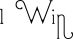

Go for the win! What we actually want to seek here is one of the winning rows which has a gap and two of the current
players symbols in. 

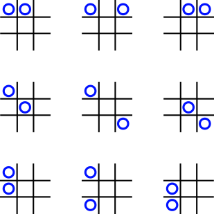

It would be useful if we could check each line without actually needing to compare all the values
individually.  There are actually ten distinct combinations of 'O' and 'X' lines, ignoring ordering and reflections, as 
can be seen in the following graphic

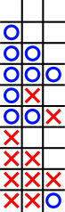

We need a method to:

* uniquely identify each of the possible lines;
* particularly pick out two Os or two Xs and a blank, whatever order the symbols are; and
* not interfere with the existing code logic.

In order to fulfil these requirements we should look at a method that combines the three internal values into a single 
value that is the same regardless of ordering: this leads us to a summation or product of the values.  Let's see how 
this works out.

Currently, we have:
```python
# Internal representations of the playing symbols
BLANK_VALUE: int = 0
O_VALUE: int = 1
X_VALUE: int = 2
```
The combinations result in:

| combination | values | sum | product |
| :---: | :---: | ---: | ---: |
| _ _ _ | 0 0 0 | 0 | 0 |
| O _ _ | 1 0 0 | 1 | 0 |
| O O _ | 1 1 0 | 2 | 0 |
| O O O | 1 1 1 | 3 | 1 |
| O X _ | 1 2 0 | 3 | 0 |
| O O X | 1 1 2 | 4 | 2 |
| X _ _ | 2 0 0 | 2 | 0 |
| X X _ | 2 2 0 | 4 | 0 |
| X X X | 2 2 2 | 6 | 8 |
| X X O | 2 2 1 | 5 | 4 |

From these results it is easy to see that two Xs and a blank uniquely give a sum of four and a product of zero; 
unfortunately two Os and a blank give exactly the same values as one X and two blanks.  The product value actually only
really identifies when there is a space in the line, and it is necessary to calculate both the sum and the product to 
correctly identify the one line that we do want.  This seems excessive.  Part of the problem with separating the 
identity of 'O' and 'X' is that the values we currently have are factors of each other, perhaps using prime numbers 
would make a difference?

Suggested new values:
```python
# Internal representations of the playing symbols
BLANK_VALUE: int = 2
O_VALUE: int = 3
X_VALUE: int = 5
```
The combinations result in:

| combination | values | sum | product |
| :---: | :---: | ---: | ---: |
| _ _ _ | 2 2 2 | 6 | 8 |
| O _ _ | 3 2 2 | 7 | 12 |
| O O _ | 3 3 2 | 8 | 18 |
| O O O | 3 3 3 | 9 | 27 |
| O X _ | 3 5 2 | 10 | 30 |
| O O X | 3 3 5 | 11 | 45 |
| X _ _ | 5 2 2 | 9 | 20 |
| X X _ | 5 5 2 | 12 | 50 |
| X X X | 5 5 5 | 15 | 125 |
| X X O | 5 5 3 | 13 | 75 |

Now we have unique values for both the two Os and the two Xs, in the sum and the product.  However, in the summation
there is a conflict of identificaion for the rows consisting of three Os and of a single X.  We could experiment with
other values, but the product values are fully unique across our requirements.

In order to seek a winning move we can scan through the `WINNING_COMBINATIONS` to search for a product of 18 for a 'O'
win or 50 for an 'X' win.  In our code we can do something like this:
```python
# New imports
from collections import defaultdict
from functools import reduce
from operator import mul

# Update the internal representations of the playing symbols, this will automatically change 
# the internal values throughout the program.
BLANK_VALUE: int = 2
O_VALUE: int = 3
X_VALUE: int = 5

# Add a new function to the class.
class TicTacToe:
  
    def _ai_move(self) -> int:
        """Identify a move for the computer to make"""
        winning_lines = defaultdict(set)
        for line in WINNING_COMBINATIONS:
            prod = reduce(mul, [self._board[c] for c in line])
            winning_lines[prod].add(line)
```
We are creating a dictionary of lines that share the same 'product value', so if there are multiple lines capable of a
winning move then they will all be listed in the `set` associated with the appropriate value. Speaking of winning moves,
it would be useful to define the values that we are looking for up at the top of the file, we'll create a dictionary
named `WINNING_PROD`:
```python
# The product of values in an *almost* winning line…
WINNING_PROD = {
    O_VALUE: O_VALUE * O_VALUE * BLANK_VALUE,
    X_VALUE: X_VALUE * X_VALUE * BLANK_VALUE,
}
```
Note that the references are for `O_VALUE`, `X_VALUE` and 'BLANK_VALUE' so that if we change those again, they will 
be automatically updated.  Now that that has been done, it is a very simple test to check if a winning line is 
available.
```python
        # 1. Let's see if there is a winning line for the current player
        if winning_lines[WINNING_PROD[self._turn]]:
            # find the blank in the first winning line.
            line = winning_lines[WINNING_PROD[self._turn]].pop()
            return [n for n in line if self._board[n] == BLANK_VALUE][0]
```
This takes advantage of the `defaultdict` property of returning an empty entry if the requested index doesn't exist.  If
there is a set associated with the appropriate index then one item, it doesn't matter which as multiple entries will all
be appropriate 'nearly winning lines.'  A list comprehension searches out the `BLANK_VALUE` and finally returns the 
_internal_ location of the gap by dereferencing the first, and only, element.

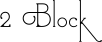

If we cannot win with the next move, then the next priority is to make sure that our opponent doesn't win… we need to 
play a blocking move; or, to put it another way, put our symbol in the spot when the opponent could make a winning
move.  Conveniently we have already created a dictionary holing all the lines that could be played, and that includes 
'nearly winning lines' of our opponents too.  This means that a block move is just a case of looking for a winning
position like above, but for the opponent.
```python
        # 2. Block: If the opponent has two in a row, the player
        #       must play the third themselves to block the opponent.
        if winning_lines[WINNING_PROD[OPPONENT[self._turn]]]:
            # find the blank to play a block.
            line = winning_lines[WINNING_PROD[OPPONENT[self._turn]]].pop()
            return [n for n in line if self._board[n] == BLANK_VALUE][0]
```
This is almost exactly the same as the first section above, but uses the `OPPONENT` dictionary to pick out our
opponents symbol instead.

The similarities of these two pieces of code indicate a good place to examine for refactoring once we have completed
the function.

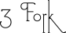

Creating a fork means placing a piece that can contribute to two separate lines to give a win.


In this image the first two grids show 'O' having just played a fork move (indicated by the green 'O'); in the second 
two grids we see just why these positions are called 'forks,' the cyan '+' marks the alternative places that 'X' could 
play, in each case 'O' wins on the next turn by playing the alternative.

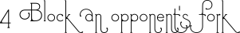

In a similar case to the above, blocking an opponent's fork means anticipating when your opponent is about to play 
a move that will lead to a fork and playing in that spot before they can.  If we examine the moves leading up to 
position _A1_ above:

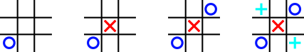

'O' starts off playing in the bottom corner, 'X' replies by playing in the middle, then 'O' plays in the opposite 
corner… at this point 'X' spots that 'O' can play in either of the other two corners (marked with the cyan '+' symbols) 
and end up with a fork: he cannot possibly block both of these cases though, and so the actual solution is to go for 
the draw and play in a side.

For now, we'll leave coding of forks because we want some form of weakness in our algorithm that a player might have 
some small change of winning!

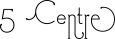

This play is a no-brainer: play in the centre. If this is the very first move of a game, then this is not such a good
move though, as playing in a corner is the move that grants your opponent the most opportunities to make a mistake.
```python
        # 5. Center: A player marks the center.
        if self._board[4] == BLANK_VALUE:
            return 4
```

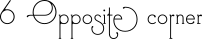

If we have progressed this far through our algorithm, then the chances are that there haven't been many moves: let's 
see if we can find an empty space opposite a space occupied by our opponent:
```python
        # 6. Opposite corner: If the opponent is in a corner, the
        #       player plays the opposite corner.
        for x, y in [(0, 8), (2, 6), (6, 2), (8, 0)]:
            if self._board[x] == OPPONENT[self._turn] and self._board[y] == BLANK_VALUE:
                return y
```

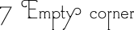

Failing to find an opposite corner, we just select an empty corner.
```python
        # 7. Empty corner: The player plays in a corner square.
        for x in [0, 2, 6, 8]:
            if self._board[x] == BLANK_VALUE:
                return x
```

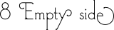

Finally, all other spaces have been checked, so there can only be side(s) remaining. Select one of those.
```python
        # 8. Empty side: The player plays in a middle square on any
        #       of the 4 sides.
        for x in [1, 3, 5, 7]:
            if self._board[x] == BLANK_VALUE:
                return x
```
By the time we have worked through all of these options a valid move will have been returned—in _internal_ 
representation. However, what if something that we were not expecting happened?  For example, if the `_ai_move()`
method was called when the board has no moves left?  It is worth including an exception at the end of a routine
that is intended to return a value, rather than leave it to default to returning `None`:
```python
        raise InvalidMove(f"Couldn't identify a move to make for AI controlled {self.player}")
```

<a name='its-your-move-machine'></a>
### It's your move machine!

Our `_ai_move()` method is now as complete as we need it to be, so all that is required is to build a mechanism for it
to be called.

First off, as we will want to let the player know what is going on we need to have a method that calls this internal 
method and translates it to _external_ representation ready to be shown to the user.  The easiest, and quickest, way to
achieve this is to add a method like this:
```python
    def ai_move(self) -> str:
        return str(self._cell_to_ndx_(self._ai_move()))
```
We wrap up the internal method in a call to the helper method `_cell_to_ndx()` before casting it to a string ready for
return.

The driver code at the bottom of our file can now be modified to make use of this at any time to request an automatic
move selection: notice that it doesn't look for an 'O' move or an 'X' move, it looks purely for a _next_ move.  This 
being the case, we can replace the move request `input()` with a call to `game.ai_move()` and receive an appropriate
selection regardless of which player is next.  So, we can replace:
```python
                mv = input(f'Where would you like to play your {game.player}? ')
                position = int(mv)
```
with
```python
                if game.player == O_SYM:
                    mv = input(f'Where would you like to play your {game.player}? ')
                else:
                    mv = game.ai_move()
                    print(f'\nComputer chooses to play {game.player} at {mv}.')
                position = int(mv)
```
and the computer will seamlessly take over playing the 'X' moves.


## And finally Esther…

There you have it: a playable naughts and crosses game to keep your little darlings entertained for hours… however, 
there is always room for improvement. For example:

* In the `_ai_move()` code there is a great similarity in the code between options 1 (win) and 2 (block), maybe this 
  could be pulled out into a helper method?
* Once you start playing, there is no easy way to stop: would it be possible to give an easy escape by watching for 
  the player typing 'quit' or just 'q'?
* The printing of the grid doesn't give any help as to the numbers to press: you just have an error message telling you
  that the numeric keypad is the pattern to follow. What is a player is using a laptop without a numeric keypad?
  

## Gists of code:

For your convenience, the completed versions of the naughts and crosses code are stored here:

* Manual version: [tictactoe_manual.py](https://gist.github.com/GeoffRiley/5df355830937dd84828fd7470c3b46ac)
* Computer assisted version: [tictactoe_ai.py](https://gist.github.com/GeoffRiley/84a4c52af105062c6620cb405da6660c)

-- [Geoff Riley](pages/guests.html#geoff-riley)

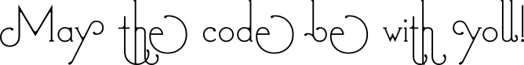

<a name='references'></a>
## References

* [Wargames (1983)](https://www.imdb.com/title/tt0086567/)
* [Wikipedia article on Tic-tac-toe](https://en.wikipedia.org/wiki/Tic-tac-toe)
* [PyBites coding challenge 12](https://codechalleng.es/challenges/12/)
* [Naught vs. Nought](https://www.grammar.com/naught_vs._nought)
* [Python Docs, `itertols.cycle(iterable)`](https://docs.python.org/3.8/library/itertools.html#itertools.cycle)
* [Python Docs, Nested list comprehension](https://docs.python.org/3.8/tutorial/datastructures.html#nested-list-comprehensions)
* [Python Docs, `all(iterable)`](https://docs.python.org/3.8/library/functions.html#all)
* [Python Docs, `any(iterable)`](https://docs.python.org/3.8/library/functions.html#any)
