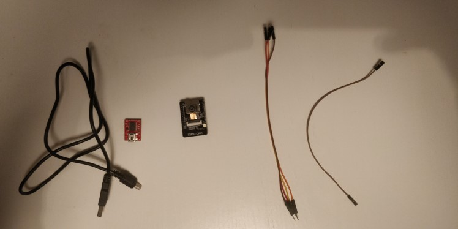
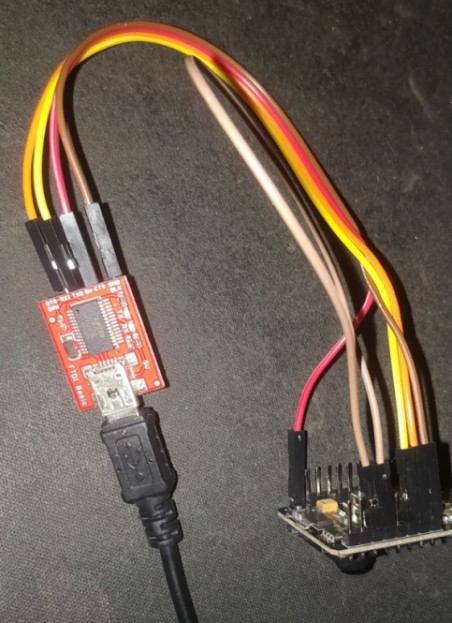
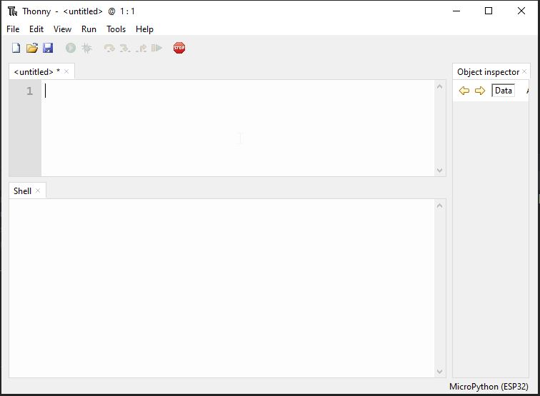
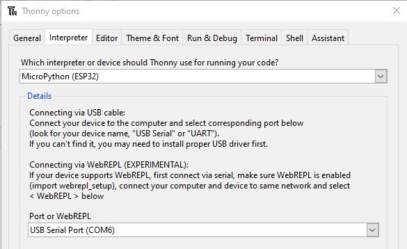
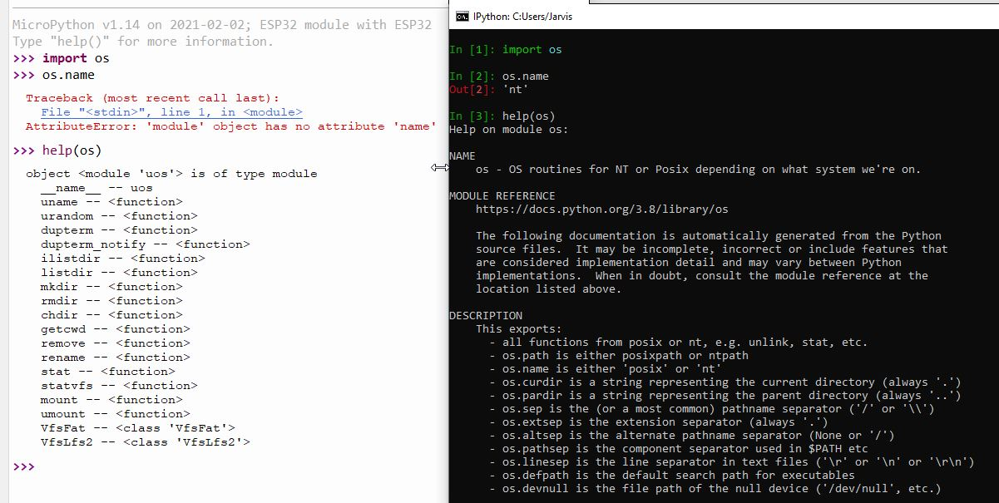
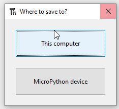
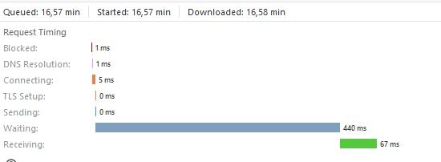

Title: And now for something completely different... MicroPython!
Date: 2021-02-02 13:37
Category: Learning
Tags: micropython, microcontrollers, esp32, IOT 
Slug: guest-something-completely-different-micropython
Authors: Cedric Sambre
summary: What if you could control a little circuitboard with a bunch of IO's, integrated WiFi and a camera slot on board? 
cover: images/featured/pb-guest.png

Don't ask why, don't ask how, but I recently found myself purchasing a bunch of microcontrollers and circuitboards again!
Today, I'll take you with me on my path through the circuits of the ESP32-CAM!

## Index
* [A little different](#a-little-different)
* [Requirements](#requirements)
* [Laying it out](#laying-it-out)
* [Wiring it up](#wiring-it-up)
* [Micropython](#micropython)
* [Thonny: Accessing the interpreter](#thonny-interpreter)
* [Automation the MicroPython way](#automation-themicropython-way)
* [Installing packages: upip](#installing-packages-upip)
* [Moving forward](#moving-forward)
* [A different approach](#a-different-approach)
* [Conclusion](#conclusion)


<a name="a-little-different"></a>
## A little different
Don't worry, I just really wanted to use that <a href="https://en.wikiquote.org/wiki/And_Now_For_Something_Completely_Different">Monthy Python quote</a>.

This article is still going to be about Python, but we'll be using it on a different "level" than we usually do, but then again, it's the same...


The focus will be more on the setup and exploring the possibilities of running Python on microprocessors, there's no real advanced code in here, just a different way into our habitat!
 
There will also be a few Hardware requirements if you really want to dive into this stuff, but you can perfectly read along without it.
All of this stuff will be available for about 15-20$ with jumper cables and everything included, and that's with a margin of 5-10$ depending on where you get your stuff!

<a name="requirements"></a>
## Requirements
### Software
* [Thonny](https://github.com/thonny/thonny)

### Python libraries
* [esptool](https://github.com/espressif/esptool)

### Hardware
This are just pages with a lot of info, not necessarily where I bought them. You might have this stuff laying around or find it elsewhere cheaper! 
* [FTDI programmer](https://learn.adafruit.com/ftdi-friend)
* If you have an Arduino laying around, that can be used as well but will require some changes to the setup. I did it with an old [Arduino Uno](https://store.arduino.cc/arduino-uno-rev3) before!
* [ESP32-CAM Module](https://www.espressif.com/en/news/ESP32_CAM)
* Some jumper cables, I used 4 male to female, and a single female to female jumper.


<a name="laying-it-out"></a>
## Laying it out



From left to right:

* Mini Usb Cable (for the FTDI Programmer)
* FTDI Basic from Sparkfun
* ESP32Cam Module
* Jumpers

The ESP32 board is 2.5 cm x 4 cm or about 1 x 1.5 inches.
It has a very low power usage (down to 6mA in deep sleep mode) and this esp32-cam version came with an OV2640 camera, an onboard led-flash (for the camera), sd card slot and WiFi and BLE module.

I expected nothing much when I ordered them, but oh boy, was I in for a suprise.

<a name="wiring-it-up"></a>
## Wiring it up

This part, although for some of us a bit out of our comfort zone, is really just what we've been doing since forever.
Matching types and shapes.

5V goes into 5V, GND goes into GND, What you T(ransmit)X on one end must be R(eceived)X'ed on the other and vice versa.
Finally, the F2F jumper goes from GPIO 0 to GND.



That last wire is because the board's internals check if that pin is set to decide if it will boot in normal mode or in programming (Flash) mode.

Inside the circuitry of the ESP32, GPIO 0 is connected to a 10KΩ [Pull up resistor](https://eepower.com/resistor-guide/resistor-applications/pull-up-resistor-pull-down-resistor/).
This circuit creates a voltage on GPIO0 causing it to be set to 'HIGH' (meaning there is a certain voltage on it).
The ESP32 boot code checks if this pin is High to decide if flash memory can be written or if it should just read it and boot on. 

That might sound complex, but look at it like this:

```python3
if GPIO0:
    boot_normally()
else:
    enter_programming_mode()
```
Not like that boot code is written in Python, but again. It's the same, but different :-)

By connecting that GPIO pin to Ground, we're giving the current an easier road to take towards ground, so it wont flow to the chips GPIO0, and that pin state will turn LOW (no / low voltage), entering programming mode.

<a name="micropython"></a>
## MicroPython: For really tiny computers

If anyone would've told me a couple years ago that I would be working on 512KB of RAM and a blasting 240MHz dual core processor again, I wouldn't believe 'em, yet here we are.
But there's a problem. Just starting a blank interpreter is already using about 5MB of RAM on my Windows machine. 

Usually these ESP's are programmed using C or Assembly. Surely it can't run Python?

Enter [Micropython](http://micropython.org)!

There's a lot to be said about the Micropython project. But the most important thing to know is that it's a very lightweight python compiler and runtime that exposes some additional libraries for direct control of the hardware.

<a name="firmware-flashing-esptool"></a>
## Flashing the firmware with esptool.py

If you've wired everything up like I said and connect the FTDI programmer to your computer, we can get to a cozy new pip environment and install `esptool`.

`pip3 install esptool`

ESP Tool is a super cool toolbox to do all sorts of programming on the different ESP chips. Here's what it can do:


```
esptool.py
esptool.py v3.0
usage: esptool [-h] [--chip {auto,esp8266,esp32,esp32s2,esp32s3beta2,esp32c3}] [--port PORT] [--baud BAUD] [--before {default_reset,no_reset,no_reset_no_sync}] [--after {hard_reset,soft_reset,no_reset}] [--no-stub] [--trace]
               [--override-vddsdio [{1.8V,1.9V,OFF}]] [--connect-attempts CONNECT_ATTEMPTS]
               {load_ram,dump_mem,read_mem,write_mem,write_flash,run,image_info,make_image,elf2image,read_mac,chip_id,flash_id,read_flash_status,write_flash_status,read_flash,verify_flash,erase_flash,erase_region,version,get_securit
y_info}
               ...

esptool.py v3.0 - ESP8266 ROM Bootloader Utility

positional arguments:
  {load_ram,dump_mem,read_mem,write_mem,write_flash,run,image_info,make_image,elf2image,read_mac,chip_id,flash_id,read_flash_status,write_flash_status,read_flash,verify_flash,erase_flash,erase_region,version,get_security_info}
                        Run esptool {command} -h for additional help
    load_ram            Download an image to RAM and execute
    dump_mem            Dump arbitrary memory to disk
    read_mem            Read arbitrary memory location
    write_mem           Read-modify-write to arbitrary memory location
    write_flash         Write a binary blob to flash
    run                 Run application code in flash
    image_info          Dump headers from an application image
    make_image          Create an application image from binary files
    elf2image           Create an application image from ELF file
    read_mac            Read MAC address from OTP ROM
    chip_id             Read Chip ID from OTP ROM
    flash_id            Read SPI flash manufacturer and device ID
    read_flash_status   Read SPI flash status register
    write_flash_status  Write SPI flash status register
    read_flash          Read SPI flash content
    verify_flash        Verify a binary blob against flash
    erase_flash         Perform Chip Erase on SPI flash
    erase_region        Erase a region of the flash
    version             Print esptool version
    get_security_info   Get some security-related data
```

So there's a few things we're going to want to do:

1. First we want to clear the flash memory (I have some C Code on there, or there might be factory firmware on your end)
2. Next we want to write the micropython Firmware to the flash memory

In my case, the FTDI programmer got detected as port COM6. So we can erase the flash with:

`esptool.py --port COM6 erase_flash`

You could set other arguments, but the tool figures out most of it on its own.
After 12 seconds, the programmer was done.

```
esptool.py v3.0
Serial port COM6
Connecting........_____
Detecting chip type... ESP32
Chip is ESP32-D0WD (revision 1)
Features: WiFi, BT, Dual Core, 240MHz, VRef calibration in efuse, Coding Scheme None
Crystal is 40MHz
MAC: f4:cf:a2:99:c0:38
Uploading stub...
Running stub...
Stub running...
Erasing flash (this may take a while)...
Chip erase completed successfully in 12.6s
Hard resetting via RTS pin...
```


After erasing te flash, push the tiny reset button on your ESP. The FTDI tries to do a reset, but we didnt connect any Reset cables.

I read that it required soldering an extra capacitor to 2 pins on the ESP board in order to have it reset automatically, and figured it was less effort to just push the damn button :-)

Next, we want to write the Micropython firmware to the flash memory, so we can boot off of that.

It's important to note that the ESP32 documentation states the bootloader starts at address 0x1000. So that's were we'll start writing the firmware.

```
esptool.py --port COM6 write_flash 0x1000 E:\Users\Jarvis\Downloads\esp32-idf3-20210202-v1.14.bin

esptool.py v3.0
Serial port COM6
Connecting........
Detecting chip type... ESP32
Chip is ESP32-D0WD (revision 1)
Features: WiFi, BT, Dual Core, 240MHz, VRef calibration in efuse, Coding Scheme None
Crystal is 40MHz
MAC: f4:cf:a2:99:c0:38
Uploading stub...
Running stub...
Stub running...
Configuring flash size...
Compressed 1445632 bytes to 925476...
Wrote 1445632 bytes (925476 compressed) at 0x00001000 in 81.9 seconds (effective 141.3 kbit/s)...
Hash of data verified.

```

You can find the different MicroPython firmware versions for ESP32 [here](https://micropython.org/download/esp32/)!

When this is done we can disconnect the wire running from GPIO0 to GND, so the ESP will know it can boot.
It will start booting from that address 0x1000 where the bootloader for our micropython environment is now waiting!

It's best practise to always remove all power sources before adding or removing cables or components, so unplug your USB!

We'll leave the other wires all connected for now.
TX and RX will be used to communicate with the interpreter on the board, and our 5v and GND will provide power to the ESP32 to keep it running.

We don't have to worry about the draw on the USB port, as a single USB port usually allows at least 500mA to be drawn, and from what I've found, the highest peak draw from an esp32 was about 450 mA.

<a name="thonny-accessing-interpreter"></a>
## Accessing the interpreter with Thonny

I had never heard of Thonny before reading about MicroPython, but it's a very minimalistic Python IDE that also integrates smoothly with Micropython.



In order to set it to talk to our ESP32, all we have to do is go into the settings and set the interpreter accordingly:



Thonny actually even allows you to do the whole flashing process automatically (I've conveniently cropped out the option above).

But the automatic reset does not work without an extra capacitor, which i didnt know at the time, so while debugging I grew to appreciate the versatility of esptool and chose to proceed with that.

Next, you can "Stop/Restart" the backend and your interpreter should greet you!



You can clearly see what makes a platform like micropython so small and powerful.
In our ESP we have functions for accessing our filesystem (like the SD Card if we'd use one), but no extended help text or functions like `os.name`.

We don't even have `exit()`, because we don't need it! Effectively saving a fair part of memory.

```
>>> exit()
Traceback (most recent call last):
  File "<stdin>", line 1, in <module>
NameError: name 'exit' isn't defined
```

Something we DO have, is a `network` module, since we have an on board wifi chip!

```python3
>>> import network
>>> sta_if = network.WLAN(network.STA_IF);
>>> sta_if.active(True)
True
>>> sta_if.connect("telenet-7T892F", "nofreewififoryou!")
>>> sta_if.isconnected()
True

```

Next we can set our ip configuration and check status etc:

```python3
>>> sta_if.status()
1010 # Meaning we got an IP
>>> sta_if.ifconfig()
('192.168.0.187', '255.255.255.0', '192.168.0.1', '42.2.24.0')
>>> help(sta_if.ifconfig())
object ('192.168.0.187', '255.255.255.0', '192.168.0.1', '42.2.24.0') is of type tuple
  count -- <function>
  index -- <function>
>>> sta_if.ifconfig(('192.168.0.6', '255.255.255.0', '192.168.0.1', '8.8.8.8'))

```

<a name="automation-themicropython-way"></a>
## Automation: The Micropython way.

Now this is all very nice, but as soon as we pull the power from this thing, the interpreter shuts down, the memory is emptied, and things like the `sta_if` object above that contains our configuration will be gone.

Normally, we can just open our IDE or shell, run python with some arguments and control what script is running basically 'through' the OS.

But now, just like we had to place the bootloader on position 0x1000 in the flash memory, we'll tell Micropython what to do on startup by placing a simple `boot.py` on the device.

I'll start by making the network connection and setting up the static IP like above, and we'll make a GET request to a `http.server` running on a different machine to check if everything worked.


```python3
import network
import socket

def connect_to_wifi(wait_connection=True):
    wlan = network.WLAN(network.STA_IF)
    wlan.active(True)
    wlan.connect("telenet-37854A", "")
    if wait_connection:
        while not wlan.isconnected():
            pass
    wlan.ifconfig(('192.168.0.6', '255.255.255.0', '192.168.0.1', '8.8.8.8'))


def send_test_request():
    s = socket.socket()

    ai = socket.getaddrinfo("192.168.0.4", 8000)
    print("Address infos:", ai)
    addr = ai[0][-1]
    
    s.connect(addr)
    s.send(b"GET /hello-from-esp HTTP/1.0\r\n\r\n")
    s.recv(4096) # Let's be polite.
    s.close()

def main():
    connect_to_wifi()
    send_test_request()
    
main()
```

And save it to micropython as `boot.py`, again, Thonny makes this a breeze and just gives us the choice:



After saving, just press the reset button on the ESP and soon you'll see the request come in on your `http.server`.

`::ffff:192.168.0.6 - - [03/Feb/2021 20:02:59] "GET /hello-from-esp HTTP/1.0" 404 -`

<a name="installing-packages-upip"></a>
## Installing packages: upip
Micropython is tiny but it does have multiple package management systems, one of them being upip.
Packages on the micropython filesystem are stored in the `/lib/` directory.

In order to save memory, upip doesn't come as a separate application like `pip` but as a module.
To install a package, we can `import upip` and then call the `install()` function.

```python3
import upip
upip.install('ujson')
upip.install('picoweb')
```

It's a bit limited in the sense that from the code I've seen in the current master branch, it's not possible to select specific versions.
`upip` will always install the latest version of the package, and when working with different firmwares, that can be annoying.


<a name="moving-forward"></a>
## Moving Forward from here
Now that we got a good idea of the basics and how our regular flow translates to micropython, it's time to take it a bit further.
Sadly, the official MicroPython distribution has no support for the Camera module on the ESP32-Cam, and to be completely honest, compiling the firmware with the OV2640 camera module included is a bit of a hassle.

Things got a bit complicated here and eventually even put me to a halt.
After a small break and a chat with Bob, I decided to try again with renewed effort and found [a blogpost from 2019](https://lemariva.com/blog/2019/09/micropython-how-about-taking-photo-esp32) with a pretty detailed guide to setting up camera enabled firmware.
 
Here's a picture of my stickerspot on my monitor!


Every picture is requested at a rate of about 400 ms average on the VGA (640x480) resolution:


<a name="a-different-approach"></a>
## A different approach
Like I said, I was a bit turned down by how hard it was to get the camera working.
First, the firmware didn't have the camera module, then I found firmware that did, but wasn't compatible with `picoweb`.
Next it was compatible with `picoweb` but not with `uasyncio` causing `picoweb` to crash on every request.
Then I found a version that did everything but didn't have the network module.

For compiling my own firmware I went through a maze of versions in order to find one that was compatible with the camera and the WiFi chip, but I kept running into issues. 

Even now, on every request, the interpreter is riddled with errors and warnings, the image occasionally times out or decodes incorrectly, and 400 ms average is about 2-3 FPS which is kinda slow if we wanted to stream this somehow.

MicroPython does have specialized boards out there that seem to work very well, but I don't have one of those laying around. 

I reflashed the old C firmware that ran stable and wrote a piece of code to test the speed now:

```python3
import requests

CAMERA_IP = "192.168.0.10"
PROTO = "http"
ENDPOINT = "CAPTURE"


def fetch_image():
    with requests.Session() as _sess:
        response = _sess.get(url=f"{PROTO}://{CAMERA_IP}/{ENDPOINT}")
    millis = response.elapsed.microseconds // 1000
    print(f"{millis} ms")
    return millis


def main():
    timings = [fetch_image() for _ in range(0, 50)]
    average = sum(timings) / 50
    print(f"Average: {average} ms / image")

main()
```

And we had a 400% performance increase on a range of 50 images:

```
[...]
70 ms
76 ms
62 ms
194 ms
63 ms
141 ms
206 ms
69 ms
127 ms
Average: 104.06 ms / image
```

It's hard to say if this is because of the instability of the version I'm using, or just because MicroPython is adding a whole bunch of extra overhead cycles on the 160-240MHz ESP32 CPU in camera streaming mode, but it seems that if we care about performance for the camera, we're better off to sticking to python for just the client side.

<a name="conclusion"></a>
## Conclusion

A lot of food for thought! Allthough I didn't get to test the full power of microPython, something tells me that it will run smoother on [a specialized board](https://store.micropython.org/) than on an ESP32, especially when it comes to the camera.

##### Upsides of MicroPython on esp32:
* The official firmware is easy to set up
* The interpreter over Serial allows you to test your code way faster than a C setup.
* It's python on a PCB, do you really need more ? :-)

##### Downsides of MicroPython on esp32:
* No native support for some modules like the camera
* A lot of people resorted to making their own modules = a lot of incompatible firmware / packages scattered all over the internet
* Compiling your own firmware and keeping it maintained can take a lot of time and can be hard if you haven't done it before.


--

Thanks for reading, I hope you enjoyed it as much as I enjoyed writing it. 
If you have any remarks or questions, you can likely find me on the [Pybites Slack Channel](pages/community.html) as 'Jarvis'.

Keep calm and code in Python!

-- [Cedric](pages/guests.html#cedricsambre)

