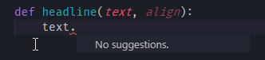
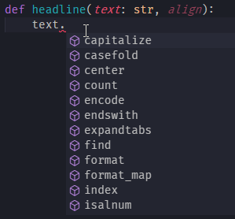
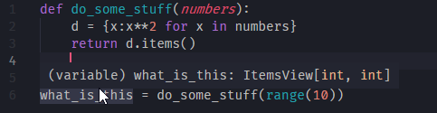
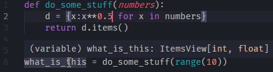
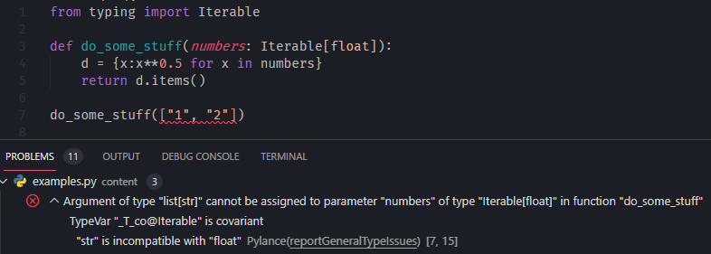
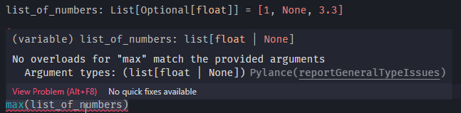
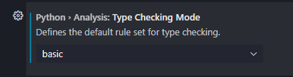
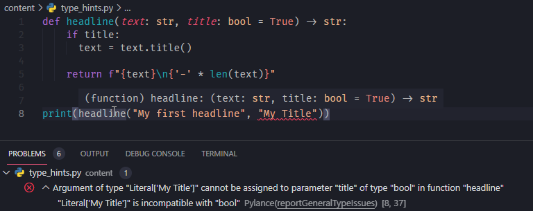
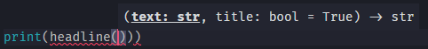
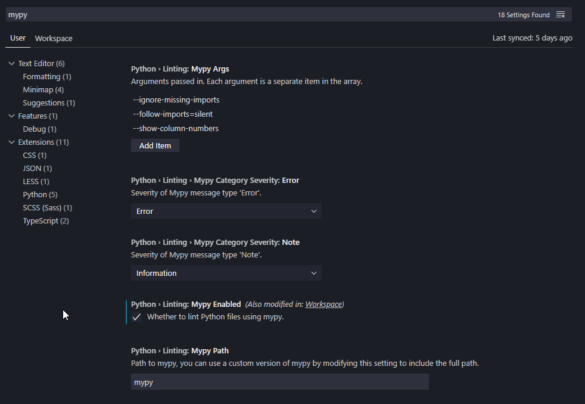

Title: Better code with type hints 
Date: 2021-05-07 20:35
Category: Concepts
Tags: guest, typing, best-practices
Slug: guest-better-code-with-type-hints
Authors: Michael Aydinbas
Summary: summary here.
cover: images/featured/pb-guest.png

With this opinionated article I advocate the use of type hints. I want to explain why you should care and why your code will be better, more bug-free, more accessible and easier to maintain. At the end I will give you some recommendations on how to get started.

Type hints is a really huge topic and a quick look at the official documentation is all it takes to feel a little lost. To be honest, I am not all too familiar with the more advanced topics myself, like _Generic_ or _Protocols_! So fear not if you feel overwhelmed by the amount of information about this topic, because, fortunately for us, getting started with type hints is really easy and does not require a lot of knowledge. **This article is aimed at newcomers to type hints and wants to help you get started**. If you enjoyed the article, I'm happy to write about more advanced topics in subsequent articles.

**Table of Contents**

- [Short introduction to type hints](#introduction)
  - [Dynamic typing](#dynamic-typing)
  - [Type hints in Python](#type-hints)
- [Examples](#examples)
  - [Better Auto-completion](#better-auto-completion)
  - [Meaningful return types](#meaningful-return-types)
  - [Meaningful nested types](#meaningful-nested-types)
  - [Meaningful empty variables](#meaningful-empty-variables)
  - [Meaningful type aliases](#meaningful-type-aliases)
  - [Avoid confusion about multiple types](#multiple-types)
  - [Avoid confusion about None](#none)
- [How to check type hints](#check-type-hints)
  - [On the console with mypy](#mypy)
  - [In the editor with Visual Studio Code](#vsc)
- [Recommendations regarding type hints](#recommendations)


<a id="introduction"></a>
## Short Introduction to Type Hints

Every programming language must have some notion of types so it knows how to work with the objects of the language and which operations are allowed in the language and which are forbidden.

So even without any explicit type definitions, Python e.g. "knows" that it's possible to add different kind of numbers

```Python
>>> type(1)
<class 'int'>

>>> type(2.2)
<class 'float'>

>>> 1 + 2.2
3.2
```

but that it's not possible to add a string and a number

```PYTHON
>>> 1 + "2.2"
TypeError: unsupported operand type(s) for +: 'int' and 'str'
```

Python informs you that the last expression is not valid and raises a `TypeError` at runtime. This is possible because Python has a type system in place and can inform you about unsupported operations. The problem now is that this happens only at runtime and not before you ship the code! That is the consequence of Python being a dynamically typed language.

<a id="dynamic-typing"></a>
### Dynamic Typing

Python is a dynamically typed language. This means two things: that the Python interpreter does type checking only as code runs, and that the type of a variable is **allowed to change over its lifetime**. 

The first means that Python will not be able to detect a problematic error like the following one before it's already too late:

```PYTHON
if False:
  1 + "two"  # This line never runs, so no TypeError is raised at runtime, ever
```

In a statically typed language like Java the compiler will inform you about the problematic `TypeError` as soon as you write the code down. In Python, however, you will not be informed about this problem until it actually occurs. If the condition were to be changed in the future and would be evaluated to `True`, the program will raise a `TypeError` all of the sudden besides having run without any problems up to this point. **So there could be a lot of hidden type errors in your code, that you are not aware of because they were never triggered in the past**. 

A second source of concern is the fact that a variable can change its type arbitrarily often:
```PYTHON
>>> thing = "Hello"
>>> type(thing)
<class 'str'>

>>> thing = 28.1
>>> type(thing)
<class 'float'>
```

There is nothing in Python that prevents a variable from changing its type. That is often exactly what we want and why we are in favor with Python for its simplicity and ease of use. However, again, this might lead to problematic behavior of your program when a variable, that once was of type x, suddenly changes its type to y and is now a completely different object. 

This might not be a big problem for code that is run as its author intended it to be run (like a command line application), but think about all the programs where the user interacts with the program by providing input or by using components of the code for his or her own program. There is no way to know about the zillion ways your code will be used by the users out there. And as there is no way in Python to protect object variables and methods against being accessed and altered or to protect an object against being sub classed, you cannot foresee possibly dangerous type changes. With type hints, however, it becomes possible with the help of the right tools to ensure and check valid types both before and even at runtime, as I will show in the remainder of this article. 

<a id="type-hints"></a>
### Type Hints in Python

Python will always remain a dynamically typed language. However, PEP 484 [[1]](#res-pep484) introduced type hints, which pave the way for performing static type checking of Python code. Unlike how types work in most other statically typed languages, type hints by themselves don’t cause Python to enforce types. As the name says, type hints just **suggest types**. 

So let's see an example of how to use type hints in Python!

The following function turns a text string into a headline by adding proper capitalization and a decorative line:

```PYTHON
def headline(text, title=True):
    if title:
      text = text.title()

    return f"{text}\n{'-' * len(text)}"
```

By default the function returns the headline title cased. By setting the `title` flag to `False` you can alternatively print the headline text unaltered as it is:

```PYTHON
>>> print(headline("My little headline"))
My Little Headline
------------------

>>> print(headline("My little headline", title=False))
My little headline
------------------
```

It’s time for our first type hints! To add information about types to the function, you annotate its arguments and return value as follows:

```PYTHON
def headline(text: str, title: bool = True) -> str:
  ...
```

This new syntax tells the reader of this code that you expect the parameter `text` to be of type `string` and `title` to be of type `bool`. In addition, with `() -> str` you inform about the return type of the function, namely `string` again. With this alone, the reader has a much clearer picture of what is going on here and what your function does: The function headline accepts a text and a Boolean and finally returns a text again. 

You might argue that this is rather obvious but I beg to differ. 

First, it would be easy to make this example much more complicated and provide a function with much 
more code where you would have a hard time to actually find the line where each function attribute is used just to understand how it is used and what its type might be. **With type hints, you know just from reading the function's definition how to call this function because you know all types of all parameters**. 

Second, there is a more subtle problem in general: **naming variables**. I deliberately choose the bad parameter name `title` instead of a more appropriate name like `titlecased` (which indicates a Boolean nature). However, you will not always be able to find a name that successfully communicates the nature of the variable to the reader, getting harder with more complex objects like classes. Whereas `text` assumably should be a `string` (but do you know for sure before you have tried it?), `title` could be many things depending on what you think the function does. Now you could go on reading the docstring of the function hoping for some clarification about what to expect from this parameter, but honestly, there might not be a docstring or at least not a very informative one. And having the type hint `bool` as an annotation right behind the `title` parameter makes things so much easier for everyone involved. 

Third, even without dedicated tools to do a static type check, you can benefit from the additional type hints when you have an editor or an Integrated Development Environment (IDE) that runs the static type checks for you in the background. I will come back to this in a minute.

Before, I want you to clearly understand one point and thus repeating myself: **adding type hints like this has no runtime effect**. Type hints are only hints and are not enforced on their own. 

Let's demonstrate what that means: due to the ability of Python to evaluate any expression to either `True` or `False`, there is a real and hard to notice bug with my function because you can call the function with a string (or any other value, for that matter) instead of a Boolean and get this:

```PYTHON
>>>  print(headline("My first headline", "My Title"))
My First Headline
-----------------
```

The headline is title cased although the attribute `title` was not set to `True`. This works because Python evaluates all strings to `True`, unless its the empty string `""`, which will be evaluated to `False`. And only because it works today is no guarantee that it will still work tomorrow! And it is clearly not what was intended by the function's author. More importantly, you cannot always tell what the function's author's intentions were given the code alone because it could be one of several things. **Type hints make intentions explicit**. And you might remember the second Zen of Python: 
> Explicit is better than implicit.


<a id="examples"></a>
## Examples

So far you have learned about static and dynamic typing and how and why to annotate a function with simple type hints. Now I want to show you a few more examples of type hints in Python and say a word or two about why they might be useful in each case.

A quick side note about the `typing` module (<a href="#res-typing-module">[4]</a>): You can always use the basic types `int`, `float`, `str`, `bool`, `bytes` without any import statement (see [[3]](#res-pysheeet) for a nice cheat sheet!). This is the most basic level of type hints. More complex data types like `list`, `dict`, `tuple`, and `set` require their own type hint imported from `typing`, so `typing.List` is the correct type hint for the `list` type. However, since Python 3.9 some of these data types can be used directly as type hints, so `list[int]` is allowed in Python 3.9 but has to be `List[int]` in previous versions. You might see both so do not get confused. You can be sure that something is a type hint when it is preceded by a colon (except for slices and dictionary definitions, but I think they are easily told apart).

My editor of choice is Visual Studio Code (VSC) and I use the Python extension with the optional Pylance language server, so you know the setup with which I recorded the screenshots. More about how to setup VSC in the section about VSC.

<a id="better-auto-completion"></a>
### Better auto-completion
First, I want to advocate type hints in favor for 100% accurate auto-completion for your favorite editor. Look at this example:



My editor cannot provide any method suggestions for `text` because it is totally unclear what the type of `text` might be. 

Adding a simple `: str` type hint solves the problem:



<a id="meaningful-return-types"></a>
### Meaningful return types

The same argument holds for return types of functions, both built-in and user-defined. You will gain 100% auto-completion (and a better understanding) about what is actually returned by a function call. Look at this example:

```PYTHON
def do_some_stuff(numbers):
    d = {x:x**2 for x in numbers}
    return d.items()
```

What is the return type of this function? Let Pylance tell us:



The function `do_some_stuff` returns both the keys and values of a dictionary. Now, without Pylance and its capabilities you would get some information about the type of the variable `what_is_this`, but only a very basic information of type `tuple`. You would not know how many elements the tuple holds nor their types. In comparison, with Pylance and the proper type hints of the `items()` method you get the much more detailed feedback of `ItemsView[int, int]`, which is awesome! You know now that `what_is_this` holds an `ItemView` instance for two `int` elements. If we change the function slightly to return the square root instead, we get the correct updated feedback that the values of the dictionary are no longer integers but now of type `float`: 



No more need to read long documentations or try out some code in an interactive shell to find out what exactly is returned by a function, just let the type hints speak for themselves. However, this requires from us coders the **curtesy and discipline of providing the right type hints** in the first place. 

<a id="meaningful-nested-types"></a>
### Meaningful nested types

Let's stay with this example for a little longer. So far I have not annotated the function `do_some_stuff` with type hints, I have just relied on Pylance's capability of inferring the correct types. If I were to add type hints to this function, how should I annotate the `numbers` parameter? Because I iterate it in line 2, it should be some kind of `Iterable`. If I were to annotate it with `list` this would mean that you can only call this function with a list and no other iterable like `range`, which was used in the example. 

The `typing` module provides all kinds of types you can use for proper type hints in more complex cases. For the case at hand, you can choose between `typing.Iterable` and `typing.Sequence`, depending on whether you want to stress `__iter__` or `__getitem__` being implemented by the attribute that is passed for `numbers`. Because the `range` function returns an object that implements both `__iter__` and `__getitem__` (so you can iterate it with `for x in range(...)` and access its element directly with `range(...)[n]`, which I did not know until now!) both type hints would be appropriate. In contrast, the `zip` function only provides an implementation for `__iter__`, so `typing.Iterable` would be appropriate but not `typing.Sequence`. 

Having decided to go with `typing.Iterable`, are you good to go? Yes and no, depending on how specific you want to get. With `Iterable` you inform about (and require, if type checked) the expectation to pass an iterable object, **but not what is expected of its elements**. For example, strings are iterables too, but would fail in this context. You have to explicitly require an iterable which elements are of type numbers. If you do not specify the type of the elements (or any variable, for that matter), their type hint becomes `Any` by default, or `Unknown` in the case of Pylance, which is the implicit version of `Any`.

So let me add a suggestion for the type hint for the `numbers` parameter:

```PYTHON
from typing import Iterable

def do_some_stuff(numbers: Iterable[float]):
    d = {x:x**0.5 for x in numbers}
    return d.items()

do_some_stuff([1,2,3,4.4])
```

This code will not produce any problems when type checked against. But when I try to pass a list with items other than numbers I will get a type error:



I imported the `Iterable` type hint from the `typing` module and specified its elements to be of type `float`. **The notation `OuterType[InnerType]` means that the outer object is some kind of container with inner objects of a certain type**. However, `OuterType` and `InnerType` have not to be different. So when you want to type annotate a list and its elements, use `list[<type>]`, e.g. `list[int]` for a list of integers or `list[str]` for a list of strings or even `list[list[int]]` for a nested list of integers (and remember that, previous to Python 3.9, you have to import `List` from `typing` instead of using the native `list` type). If you want to type annotate a dictionary, you have to provide type hints for both the key and the values, e.g. `dict[str, list]` for a dictionary that uses strings as its keys and a list as its values. It's okay to leave the type of the elements of the list undefined, **but try to be as specific and strict as much as possible**. 

<a id="meaningful-empty-variables"></a>
### Meaningful empty variables

A variable might be initialized with an empty container or `None` because its content is figured out later in the code. For example, this might be the case for the variable holding the return value of a function that is initialized right after the header. When the function's return value is correctly type annotated, this will be no problem because you already know the type of the return value thanks to the type hint in the function header. However, if the return type is not properly annotate or the variable in question is not holding the return value, do you know what it will hold?

```Python
countries: Dict[str, Tuple[str, int]] = {}
```

When you ignore the type hints for a moment, all you know about the variable `countries` is that it is a dictionary because it was initialized as such. But you have no clue about what the structure of this dictionary looks like. With the type hints, however, you know exactly what to expect from this dictionary: That its keys will be strings (the name of the countries) and that its values will be two-element tuples, the first element being a string (the country's capital) and the second element being an integer (the country's population).

This is the first example where the type annotation is done for a variable outside of a function definition. In fact, you can type annotate everything in Python, not only function parameters. But as you interact more often with functions or methods than with their actual implementation, **type hints are most valuable at places that are often visited**.  

Nevertheless, let me give you some more examples about variable type annotations outside of functions that might be useful.

```Python
class MyClass:
    # You can optionally declare instance variables in the class body
    attr: int
    ...
``` 

Here the type hint is useful given that the actual value for `attr` might be set much later, either in the `__init__()` method or even later. Before type hints we used to put the type hint in a comment, but as comments are ignored by static type checkers and are not standardized, it is much better to use a type hint as that is its purpose.

Type hints are even more useful in combination with a dataclass:

```Python
from dataclasses import dataclass

@dataclass
class Point:
  x: int
  y: int
```

Although Python does not prevent you from initializing a `Point` instance with the wrong types, so `Point("1", "2")` will not throw an error, the `dataclass` decorator will use the type hint information for some internal magic like auto-generating a `__init__(self, x: int, y: int)` method with the right type annotations for each parameter. You can even use `typing.ClassVar` to express that a variable is a class variable instead of an instance variable. In this case, again, Python does not prevent you from accessing this variable through an instance (`p.points` instead of `Point.points`) but it will prevent the class variable from being added to the parameter list of the `__init__` method!

```Python
from dataclasses import dataclass
from typing import ClassVar

@dataclass
class Point:
  x: int
  y: int
  points: ClassVar = 0
```

<a id="meaningful-type-aliases"></a>
### Meaningful type aliases

By now, you have seen a fair amount of type hints and I have to admit that readability is not always improved when types get more complicated and thus longer type hints are necessary, most of all with nested and multiple types. So instead of accepting ever longer type hints, you can improve both readability and meaning a lot by introducing your own type names. This is possible because type annotations are just Python objects and can be assigned to variables. 

Look at the following example:

```Python
Vector = List[float]
Matrix = List[Vector]
Scalar = float

def dot(v: Vector, w: Vector) -> Scalar:
  "Computes v_1 * w_1 + ... + v_n * w_n"""
  ...

def magnitude(v: Vector) -> Scalar:
  """Returns the magnitude (or length) of v"""
  ...

def shape(A: Matrix) -> Tuple[int, int]:
  """Returns (# of rows of A, # of columns of A)"""
  ...

def identity_matrix(n: int) -> Matrix:
  "Returns the n x n identity matrix"""
  ...
```

By introducing the speaking names `Vector`, `Matrix` and `Shape` as new types, the type hints not only provide information about their parameters but also inform about the domain and build a coherent domain language. Now you are able to think of the `dot` function no longer as a function that takes two list of floats and produces a single number but as an operation between two vectors that produces a scalar. And the `magnitude` of a vector is, again, a scalar, representing its length. And because the `shape` of a matrix has two elements it follows that a matrix must be some object that has two dimensions. 

By assigning new and meaningful names to existing type definitions you can further increase the readability and comprehensibility of your code and better communicate your intends to the reader.

<a id="multiple-types"></a>
### Avoid confusion about multiple types

If you need to allow multiple types, you can use `typing.Union`, e.g. `Union[str, int]` which tells the reader that a variable can be either a string or an integer. This might be useful whenever it is not possible to require a single type or you want to provide some convenience to the user of your function or class. However, it is best to avoid multiple types in favor of clarity.

Look at the following example:

```Python
def send_email(address: Union[str, List[str]], ...):
  ...
```

It seems that the authors of the `send_email` function wanted to be less strict about the type of the `address` parameter. Instead of always requiring it to be a list, they also foresaw the possibility or necessity to allow a single string. We can immediately understand this type hint as follows: When there is only a single address you want to send an email to, you can pass this address to the function as it is, but if you have multiple addresses, you can also pass the whole list and the function will take care of it. Nice to have this information directly encoded in a type hint, isn't it?

If you wonder how your favorite editor handles the case of multiple types, at least for VSC I can tell you that it's clever and suggests all methods for both strings and integers. Not what I was expecting but certainly appreciated!

<a id="none"></a>
### Avoid confusion about None

`None` is one of our best friends and can be really nasty at the same time! It is best practice to initialize optional parameters with a default value of `None` so you can check against `None` before you use the attribute and avoid the problem of some nasty bugs, e.g. when using an empty list as default (see [[6]](#res-none)). However, this does not prevent the user of your function from passing `None` to any of the parameters, even the required ones! This happens regularly, mostly when chaining functions and passing through return values. So what can you do to spot this? Use `typing.Optional` when you want to allow `None`, otherwise it will be a type error.

Let's return to the example of sending an email, this time a little mote elaborated:
```PYTHON
def send_email(
    address: Union[str, List[str]],
    sender: str,
    cc: Optional[List[str]],
    bcc: Optional[List[str]],
    subject="",
    body: Optional[List[str]] = None,
) -> bool:
    ...
```

There are a few parameters that have an `Optional` type hint, namely `cc`, `bcc` and `body`. With no type hints at all, a static type check would not give you any error when passing `None` to any of the parameters, because by default a parameter without a type hint has the type `Any`, which is also fulfilled by `None`. When adding a type hint without `Optional`, `None` is no longer a valid option and your type checker will inform you about the incompatible type. So for example when passing `None` as value for `sender` you get: Argument 2 to `send_email` has incompatible type `None`; expected `str`. 

To explicitly allow for `None` you can add `Optional` to the type hint, which allows both the actual type and the special value `None`. Now, calling the function with `None` for the `body` parameter is not a problem any more because `Optional[List[str]]` is a shortcut for `Union[List[str], None]` and thus allows for `None` values. 

A slightly different example is the following: Imagine you want to call the `max` function with some list of numbers. However, some of the numbers might actually be `None` values due to some error during the recording process (e.g. sensor values). This is a problem because the `max` function does not handle `None` values well and instead throws a `TypeError`.

```Python
>>> max([1,None,3])
TypeError: '>' not supported between instances of 'NoneType' and 'int'
```

This is hard to see without a static type checker. However, if there is a variable `list_of_numbers` that is correctly annotate with `List[Optional[float]]`, indicating that some numbers might be missing, Pylance will inform you about a problem with passing this variable to the `max` function: "No overloads for `max` match the provided arguments Argument types: `(list[float | None])`. 



So type hints successfully prevented you from running into a runtime error because of a hidden `None` value in some of the attributes.

<a id="check-type-hints"></a>
## How to check type hints 

I hope I have illustrated how type hints can increase the readability and comprehensibility of code if used wisely and consistently. They are useful for any reader of your code (including your future self) even without any static type checker. However, being able to check your code before you ship it and thus avoid errors that once were only detected after having caused a runtime error, is a big plus.  This is exactly what I will cover next. I will focus on `mypy` as the most common Python command line application and Visual Studio Code (VSC) as one of the most favored free code editors. However, you are free in the choice of your tools and there are other great alternatives like PyCharm. The key point here is that you should choose tools that support you in writing better, more concise, less error-prone, more maintainable and more readable code. Whatever tool does this for you is the right tool.  

<a id="mypy"></a>
### On the console with `mypy`

There are a lot of good resources about using `mypy`, so make sure you check out [[2]](#res-realpython) and [[7]](#res-mypy). Here, I will cover only the very basics to get you started.

`mypy` requires Python 3.5 or later to run. You can install it like any other package with Python's package manager `pip`:

```BASH
$ pip install mypy
```

Once `mypy` is installed, you have a new command available to you: `mypy`. To type check any python program you can use it as follows:

```BASH
$ mypy <python-program>.py
```

`mypy` operates a lot like a linter so it will type check your code statically, but never actually run your program. 

You can pass multiple files and even folders to the `mypy` command:

```BASH
$ mypy foo.py bar.py some_directory
```

`mypy` will check all files in a directory recursively. `mypy` has a ton of options so I refer you to the official documentation.

As a quick example, let's take the following code and put it in a python file:

```Python
from typing import List 

def greet_all(names: List[str]) -> None:
    for name in names:
        print('Hello ' + name)

names = ["Alice", "Bob", "Charlie"]
ages = [10, 20, 30]

greet_all(names)   # Ok!
greet_all(ages)    # Error due to incompatible types
```

Now you can type check the file with `mypy`:

```BASH
$ mypy greet_all.py
type_hints.py:11: error: Argument 1 to "greet_all" has incompatible type "List[int]"; expected "List[str]"
Found 1 error in 1 file (checked 1 source file)
```

<a id="vsc"></a>
### In the editor with Visual Studio Code

To use the full power of VSC for Python you will need the following extensions installed:
- [Python](https://marketplace.visualstudio.com/items?itemName=ms-python.python) (ms-python.python) from Microsoft
- [Pylance](https://marketplace.visualstudio.com/items?itemName=ms-python.vscode-pylance) (ms-python.vscode-pylance) from Microsoft 

The first enables the general support for the Python language and will allow you to select your Python interpreter, start a debug session, and run the tests whenever editing Python files. It also comes with support of Jupyter Notebooks right in your editor. Like any good IDE this extension provides IntelliSense (auto-completion, code navigation and syntax checking), support for Linting (`pylint`, `flake8` and more), as well as support for code formatting (`black`, `autopep` and more).

The second extension is not so well-known but really a game changer for working with type hints. With the latest update of the Python extension, it comes with Pylance preconfigured, so it will be installed automatically as an optional dependency. Pylance is an extension that provides additional language support by facilitating Microsoft's Pyright static type checking tool. This supercharges the IntelliSense functionality with additional rich type information. 

To enable Pylance, please follow the [Quick Start](https://marketplace.visualstudio.com/items?itemName=ms-python.vscode-pylance) guide.

Make sure that static type checks are enabled in the Pylance settings (the mode is set to off by default):



I return now to the example from the beginning, the `headline` function. Let's see what happens if I write this function within VSC and use the same function call.



You can see several things going on in this screenshot. 

First, VSC displays the function's definition as tooltip over my mouse cursor. This is already a helpful feature. But VSC does also support you with respect of each attribute. So when I start to write the function and enter the first opening parenthesis, VSC will show the name and type hint of the current attribute as well as all other attributes:



Now let's return to the first screenshot and have a look at the `title` parameter for which I tried to pass "My Title" as the attribute's value. As you can see, VSC reports an error here, indicated by the red curled underline. To check what causes this error you can either hover with your mouse cursor over the expression or look at the problems section in the bottom panel of VSC. There you will find an error message from Pylance that informs you that the literal "My Title" cannot be assigned to the parameter `title` because there is a type incompatibility. The nice thing about errors is that VSC informs you in multiple ways: the file itself will be colored red, the expression will be marked with a red curled underline and a new item will be added to the problems section. So it's really hard to ignore!

If you do not want to use Pylance that is fine! VSC supports several linters like `pylint`, `black` and `flake8` and also `mypy` as type checker. So instead of Pylance you can install `mypy` for the currently selected Python interpreter and enable `mypy` as a linter in the VSC user settings:



Just make sure that you checked "Whether to lint Python files using mypy" and you are good to go. Depending on the other settings `mypy` will now run in the background type checking your files and report all problems and warnings in the Problems section of the bottom panel.

<a id="recommendations"></a>
## Recommendations regarding type hints

By now you have seen a lot of examples how to use and leverage type hints. I hope I was able to make a point in each single case why a type hint might be useful to you and/or the reader. However, you might also think that type hints are not always improving readability, that there are downsides when using them and that not every use case might benefit from them. And you are right. Like every new tool it requires a certain time to get used to it and like every good tool, it is flexible enough to adapt it to your needs and personal style. So instead of listing all the pros and cons of type hints, I will give you some recommendations how you can start using type hints.

The most important aspect for newcomers to type hints is that Python supports gradual typing ([2](#res-pep483)). 
> Gradual typing allows one to annotate only part of a program, thus leverage desirable aspects of both dynamic and static typing.

It is perfectly fine not to use it, but you are definitely not using Python to its full potential and you are not helping others that try to understand your code. And thanks to gradual typing you don't have to go through your entire code base annotating every last piece of code for the next couple of weeks. Instead, you can follow the Pareto principle and invest your time where it counts the most. 

1. **Start annotating the central pieces of your code**. This can be the most important public functions or the most important classes. We often write a lot of smaller helper functions (ideally starting with an "_" in their name both for functions and methods) that no one calls directly and that are only called inside other functions so, at least for the reader, there is no benefit in type annotating these functions. If you want to leverage the full potential of static type checkers like `mypy` there is still a benefit from annotating everything, but as I said, we want to follow the Pareto principle here.

1. **Start with the most basic types**. It is totally fine to first limit yourself to the basic type hints like `int`, `float`, `bytes`, `bool`, `str`, `list`, `dict`, `tuple`, `set`. No need to start with the more complex types from the `typing` module. Sure it would be nice to know of what type the elements of a list are, or of what type the keys and values of a dictionary are. But knowing that a variable or attribute is expected to be a list or dictionary in the first place is the most important information. You can always return later and add more detailed type hints. And remember: beginning with Python 3.9 you can even use the native types like `list` to annotate its elements, e.g. `list[int]`, so no need to import `typing.List` for this one. 

1. **Add return types to functions**. When you start using type hints, start small but be thorough. When you annotate your first function and the return type is something else than `None`, annotate it properly. Like I said, a function's definition or header is the most important piece of information for any reader of your code as it communicates your intend. And there is no good reason to start using type hints but not adding the return type once you are at it. Don't force your readers to actually read your function to get this basic information. 

1. **Add type hints first, docstrings second**. Type hints are already a very central part of your code documentation and you should use them from the very beginning, right when you write the function for the first time, as it forces you to pause for a moment and to think about what your function is supposed to do. What are its inputs, what are its outputs? Writing docstrings is a more elaborate process as it requires you to communicate the essence of your function and the meaning of each attribute and return type in a human-readable way. So you should wait until your function is more mature and not so likely to change anymore.

1. **When writing docstrings, do not repeat type hints**. As I said earlier, type hints are a much better way to annotate types than docstrings because there is no standardized way of documenting functions in Python. I personally favor the Google style guide for docstrings because I find it the most readable and less cluttered. There are excellent extensions for VSC that help you in writing docstrings, I recommend the Python Docstring Generator by Nils Werner (which supports more than the Google format). Adding a docstring to an existing function is than a real breeze because starting with `"""` right after the header and hitting ENTER auto-completes the docstring for you with all attributes from the header of the function. But their types are also copied. This is an unnecessary redundancy and should be avoided. Use docstrings to communicate the meaning of your attributes and return type, not their type.

    So do one of the following, but not both 

    ```
    def function_with_types_in_docstring(param1, param2):
        """Example function with types documented in the docstring.

        `PEP 484`_ type annotations are supported. If attribute, parameter, and
        return types are annotated according to `PEP 484`_, they do not need to be
        included in the docstring:

        Args:
            param1 (int): The first parameter.
            param2 (str): The second parameter.

        Returns:
            bool: The return value. True for success, False otherwise.
        """

    def function_with_pep484_type_annotations(param1: int, param2: str) -> bool:
        """Example function with PEP 484 type annotations.

        Args:
            param1: The first parameter.
            param2: The second parameter.

        Returns:
            The return value. True for success, False otherwise.
    ```

And that was the last of the recommendations.

Feel free to deep dive further into the topic by reading the provided resources.

I hope you enjoyed reading this article and that I was able to encourage you to use type hints and at the same time lower the barrier to getting started a bit.

Don't hesitate to contact me via Slack, LinkedIn or GitHub if you have any questions, comments or suggestions or if you want to read more about this topic or any other topic, for that matter. You can also leave your comment right on this page.

---

Keep Calm and Code in Python!

-- [Michael](pages/guests.html#michaelaydinbas)

### Resources

<a id="res-pep484">[1]</a> [PEP 484 -- Type Hints](https://www.python.org/dev/peps/pep-0484/)

<a id="res-pep483">[2]</a> [PEP 483 -- The Theory of Type Hints](https://www.python.org/dev/peps/pep-0483/)

<a id="res-realpython">[3]</a> [Python Type Checking (Guide) -- Real Python](https://realpython.com/python-type-checking/)

<a id="res-typing-module">[4]</a> [typing module documentation](https://docs.python.org/3/library/typing.html)

<a id="res-mypy">[5]</a> [Mypy documentation](https://mypy.readthedocs.io/en/stable/index.html)

<a id="res-pysheeet">[6]</a> [Typing cheat sheet - Pysheeet](https://www.pythonsheets.com/notes/python-typing.html)

<a id="res-none">[7]</a> [Null in Python: Understanding Python's NoneType Object -- Real Python](https://realpython.com/null-in-python/#using-none-as-a-default-parameter)