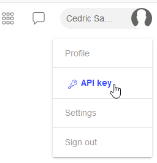
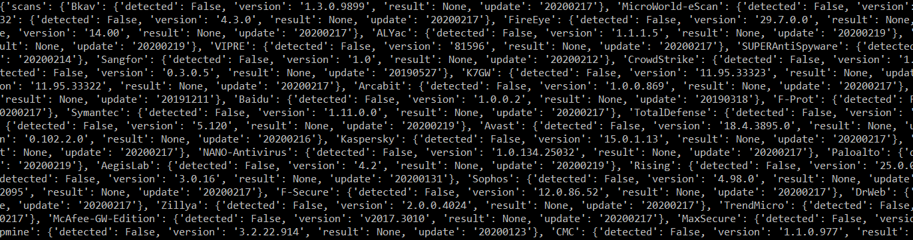
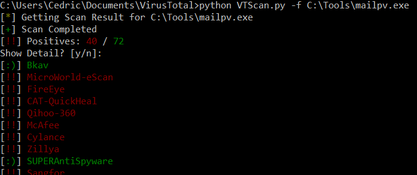
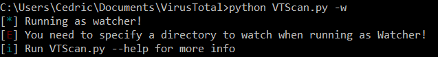
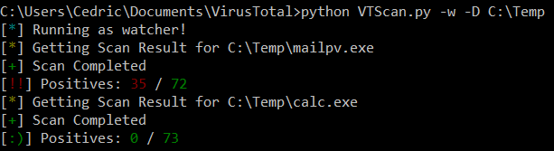
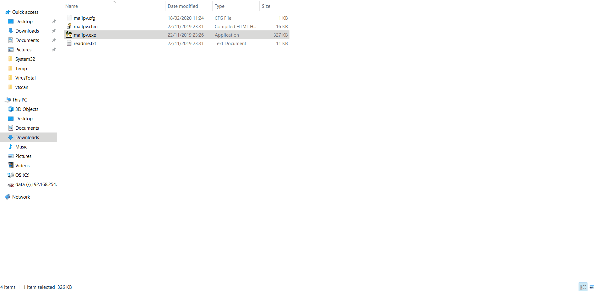

Title: Talking to API's and goodlooking tools
Date: 2020-02-24 21:39
Category: Learning
Tags: click, rest, requests, API, win10toast, directorywatcher, pywin32 
Slug: guest-talking-to-apis-goodlooking-tools
Authors: Cedric Sambre
summary: I recently ran into a tool called VTScan that uses the VirusTotal API to scan a file and print the results. I figured I could write the same, and add some functionality!
cover: images/featured/pb-guest.png

One of my go-to locations for security news had a thread recently about a tool called [VTScan](https://github.com/TheSecondSun/VTSCAN).
I really liked the idea of not having to go through the browser overhead to check files against multiple scan engines.

Although the tool (which is itself a basic `vt-cli` spinoff) already existed, I was looking for a new challenge, I decided to roll my own and add a few cool features!
I'll have a thorough look at how python talks to API's with `requests` and I look at turning all this API data into a nice GUI application with `click`.
I hope to give you some idea's for CLI styling in the future so I can see more awesome tools by you all!

You can find the full code [on my github](https://github.com/xWhiteListed/vt-scanner-python).

## Index
* [Requirements](#requirements)
* [REST](#rest)
* [API Key Protection](#api-key-protection)
* [The Setup](#setup)
* [The VirusTotal API](#virustotal-api)
    * [VT API: /file/scan](#api-file-scan)
    * [VT API: /file/result](#api-file-result)
    * [VT API: Chaining the endpoints](#api-chain-endpoints)
* [Making pretty CLI Tools with Click](#pretty-with-click)    
    * [Helpers, they really do help](#helpers)
    * [Arguments, options and flags](#arguments-options-flags)
* [Adding more functionality: The watcher](#adding-the-watcher)
    * [Additional work on the arguments](#additional-work-arguments)
    * [Watching a directory: Win32](#watching-a-directory-win32)
    * [Adding Toast messages: Win10Toast](#win10toast)

<a name="requirements"></a>
## Requirements 
* [PyWin32](https://pypi.org/project/pywin32/)
* [Click](https://pypi.org/project/click/)
* [Requests](https://pypi.org/project/requests/)
* [Win10Toast](https://pypi.org/project/win10toast/)
* [Colorama](https://pypi.org/project/colorama/) (optional, but prettier)

<a name="rest"></a>
## REST
What is REST?

According to Wikipedia:
> Representational state transfer (REST) is a software architectural style that defines a set of constraints to be used for creating Web services. Web services that conform to the REST architectural style, called RESTful Web services, provide interoperability between computer systems on the Internet. RESTful Web services allow the requesting systems to access and manipulate textual representations of Web resources by using a uniform and predefined set of stateless operations. Other kinds of Web services, such as SOAP Web services, expose their own arbitrary sets of operations.

So in human language, a REST API is just a web-based endpoint that we can send HTTP requests to.
This endpoint in turn will query an application on the backend and will return some data based on what the application does.

In our example, we will post a file to a webserver, and the webserver will send the file to a number of anti-virus scanners.
The results of all these scans will be put in a report to indicate if a file has been flagged as a virus or not.

<a name="api-key-protection"></a>
## Note: API Key Protection
Before we get into the action, I want to leave a small note about protecting your API keys.
Your API key is a unique identifier and authorization mechanism to allow you to access certain services (like REST API's) with just a single key.

If anyone manages to get a hold of this unique string, people WILL be able to query the service as if they are you.

Something very common is that developers accidentally [push their code including API keys to github](https://nakedsecurity.sophos.com/2019/03/25/thousands-of-coders-are-leaving-their-crown-jewels-exposed-on-github/), and thus everyone can access the service as that developer.

Bob mentioned a common way to tackle this problem in his [mentoring session digest](https://pybit.es/python-mentoring-session.html) where he uses `os.getenv`.

I personally tend to create a `sensitive.py` file, which I then add to my `.gitignore`. 

This allows me to import my sensitive data like: `from sensitive import APIKEY`.

(Of course, the API key is still stored in a file, so Bob's way of using `os.getenv` is waaay more foolproof!)

Either way, hide those keys!

<a name="setup"></a>
### The Setup

1. Get a free API key at [VirusTotal](https://www.virustotal.com) by creating an account and getting the API-key from your profile:

 

2. Install the required packages:

`pip3 install pywin32 click requests win10toast`

(Optional):  Install the `colorama` package if you would like colors!

`pip3 install colorama`

This package is used by `click` to draw terminal colors, but `click` can run perfectly without it.

<a name="virustotal-api"></a>
### The VirusTotal API

The first thing you should do when implementing an API that you don't know, is to [Read the Manual!](https://developers.virustotal.com/reference)

A lot of times, sample code is provided to get you started, and usually, API documentation lists all endpoints you can query to get information.
Besides, your tool acts **like** a *view* for the API, so you need to know what you have to send, what you can expect, and what is required to make requests.


So go ahead and have a quick look the 2 links below and just read through them.  
I'll be focusing on [/file/scan](https://developers.virustotal.com/reference#file-scan) and on [/file/report](https://developers.virustotal.com/reference#file-report) for the purpose of this article!

<a name="api-file-scan"></a>
### The VT API: /file/scan

The endpoint is described as follows:
> This endpoint allows you to send a file for scanning with VirusTotal. Before performing your submissions we encourage you to retrieve the latest report on the file, if it is recent enough you might want to save time and bandwidth by making use of it. File size limit is 32MB, in order to submit files up to 200MB in size you must request a special upload URL using the /file/scan/upload_url endpoint.

The python example looks like this:

```python
import requests
url = 'https://www.virustotal.com/vtapi/v2/file/scan'
params = {'apikey': '<apikey>'}
files = {'file': ('myfile.exe', open('myfile.exe', 'rb'))}
response = requests.post(url, files=files, params=params)
print(response.json())
```

*What is going on?*
* We make a very simple HTTP Post request to the VirusTotal scan endpoint.
* As parameter, we send our API-key for authorization
* We add the file to our body
* We print out the response in json.

Let's run this and have a look at the data that's being returned:

```json
{
    "scan_id":"8fbc375f08b4cb9b55c64f14b32891f9703ab3e69ca13f504deec7655fcd13b6-1582211127"
    "sha1":"552d86c190fb6ad0f4734f44e59dce91fc364230"
    "resource":"8fbc375f08b4cb9b55c64f14b32891f9703ab3e69ca13f504deec7655fcd13b6"
    "response_code":1
    "sha256":"8fbc375f08b4cb9b55c64f14b32891f9703ab3e69ca13f504deec7655fcd13b6"
    "permalink":"https://www.virustotal.com/file/8fbc375f08b4cb9b55c64f14b32891f9703ab3e69ca13f504deec7655fcd13b6/ana ..."
    "md5":"f9615c7e8528ed16b213a796af2ef31b"
    "verbose_msg":"Scan request successfully queued, come back later for the report"
}
```

Looking good, although we don't have the results we're looking for yet, in terms of positives per scanner.

<a name="api-file-report"></a>
### The VT API: /file/report

This endpoint is described as follows:

> The resource argument can be the MD5, SHA-1 or SHA-256 of a file for which you want to retrieve the most recent antivirus report. You may also specify a scan_id returned by the /file/scan endpoint.

Again, the python code is straightforward:

```python
import requests
url = 'https://www.virustotal.com/vtapi/v2/file/report'
params = {'apikey': '<apikey>', 'resource': '<resource>'}
response = requests.get(url, params=params)
print(response.json())
```

*What is going on?*
* We make a HTTP GET Request to the `/file/report` endpoint this time.
* As parameter, we send our API-key for authorization, and a resource.
    * According to the documentation, this resource can be either and MD5, SHA1, SHA256 or Resource value
    * We have obtained all these values above through the /file/scan endpoint

<a name="api-chain-endpoints"></a>
### VT API: Chaining the endpoints together

What we ultimately want to reach, is that we can run the script, pass a file to it, and it uploads and scans the file and prints the result without our intervention.
By now we know a few things:
* In order to get a scan report, we need to request the report  from `/file/report` based on the resource-id
* We can get a resource-id for a file by posting the file to the `/file/scan` endpoint.

Here's the function I wrote to contact the `/file/scan` endpoint:

```python
def scan_single_file(file):
	url = 'https://www.virustotal.com/vtapi/v2/file/scan'
	with open(file, "rb") as _f:
		with requests.Session() as _sess:
			response = _sess.post(url, files={'file': _f}, params=params)
	json_resp = response.json()
	resource = json_resp['resource'] # Extract the "resource" value from the JSON data
	_print_prefixed_message('*', 'yellow', f'Getting Scan Result for {file}')
	generate_scan_report(resource) # Call function to generate scan report based on the resource
```
The first thing you might notice is that I do not have a declaration for params in this function.

That is because params has to be sent to the endpoint every time.
So if we want to reuse it in every function and it never changes, we can easily set a global variable at the top of our code that will act as a constant.

A lot of people dislike working with global variables because it might not always be clear where the values are coming from. 

```python
from sensitive import APIKEY
params = {'apikey': APIKEY}

def ...
```
Because we are writing a single, non-object-oriented script, this is perfectly fine, and it should still be clear where this variable is coming from.

Apart from that, we're pretty much doing the same as the example script, but we're making sure our files and sessions get closed properly by using the `with .. as .. :`-format.
Don't worry too much about `_print_prefixed_message()`, we'll get to that later when we discuss the magic that `Click` is!

If you don't understand `json_resp['resource']`, remember that Json is just another `dict` in python, and dicts have keys!

```python
In [1]: example_json = { 'id': 1, 'name': 'Jarvis' }

In [2]: type(example_json)
Out[2]: dict

In [3]: example_json.keys()
Out[3]: dict_keys(['id', 'name'])

In [4]: example_json['name']
Out[4]: 'Jarvis'
```

So now we have a function to upload the file and get the resource-id. 
Next we'll need a function to get the scan report based on this resource-id!

```python
def generate_scan_report(resource_id):
	url = 'https://www.virustotal.com/vtapi/v2/file/report'
	local_params = {'resource': resource_id}
	
	full_params = dict()
	full_params.update(params)
	full_params.update(local_params)
	
	with requests.Session() as _sess:
		response = _sess.get(url, params=full_params)
	
	json_resp = response.json()
	for key in json_resp.keys():
		if key == "scans":
			vendor_table = json_resp[key]
		elif key == "verbose_msg":
			result_message = json_resp[key]
		elif key == "total":
			total_scans = json_resp[key]
		elif key == "positives":
			total_positives = json_resp[key]
		elif key == "permalink":
			permalink = json_resp[key]
		elif key == "scan_date":
			scan_date = json_resp[key]
	print_scan_report(vendor_table, permalink, scan_date, result_message, total_scans, total_positives)
```
*What is going on?*
* Why are you updating dicts?
    * We have to send a GET request, with our `resource`-id as a parameter
    * We also (still) have to pass our API-key parameter!
    * Parameters to `requests` POST or GET, are `dict`s.
    * By calling `one_dict.update(other_dict)` we can put 2 dicts together into a single one!
* After the parameter-preparation is done, we make our request and capture the response
* We get some interesting values from the scan report
* We pass it on to get printed (Next up!)

If we look at the data that's coming back from the report endpoint we see it looks like this:

```python
{'scans': {'Bkav': {'detected': False, 'version': '1.3.0.9899', ...
```
Awesome that's exactly what we need but in it's current state, the tool is not really usable.

However, in terms of what we need to know from the API, we're all done.
Very often, creating a tool that chains API endpoints together can be done with just a few lines of code and the `requests` library.

You can go out there right now, find an API of your liking, and start getting that data!

When you've done all that, you can come back here and we'll get to making things pretty and usable!

<a name="pretty-with-click"></a>
## Making pretty CLI Tools with Click
If you've read [my previous post](https://pybit.es/guest-webscraper-to-wordcloud.html), you know I like my data pretty!

So the end goal in this chapter will be to go from this:



To this:



<a name="helpers"></a>
### Helpers, they really do help
Earlier, I promised an explanation for that `_print_prefixed_message()` function.
The `click` library provides 2 basic print functions `click.echo` and `click.secho` 

There's the option to add `style()` to `click.echo`, but `secho` already does this for us.

From the docs:
> The combination of echo() and style() is also available in a single function called secho()

Here's the prototype:

`click.secho(message=None, file=None, nl=True, err=False, color=None, **styles)`

Do you see those little `[:)]`'s and `[!!]`'s in their respective colors?

In the beginning they were all individually printed, so I had multiple calls actually doing the same.
When you're duplicating code, there's probably a way to throw it in a function:

```python
def _print_prefix(character, color):
	click.secho('[', nl=False)
	click.secho(character, fg=color, nl=False)
	click.secho('] ', nl=False)

def _print_prefixed_message(character, color, message):
	_print_prefix(character, color)
	click.secho(message)
```

*What's going on?*

- We're echo'ing a bracket, without starting a new line

- We print the characters that our `_print_prefix` received as an argument, together with the color of our choice, again no new line!

- We close off our prefix with a closing bracket, still no new line!

- In `_print_prefixed_message`, we simple call a function that does the above, and we add a message!

Instead of having to write 4 `click.secho's` every time I want to print a message, I can simply call:

`_print_prefixed_message('*', 'yellow', f'Yellow prefixed message for you!')`

If you have the feeling you're duplicating code and just making minor changes, take the time to look at what you're doing and sometimes, you can make a helper to help you!

Here's an example use of `_print_prefix()` in case you're rightfully wondering why I broke those up.

```python
def print_vendor_table(vendordict):
	for vd in vendordict.keys():
		if vendordict[vd]['detected']:
			_print_prefix('!!', 'red')
			click.secho(vd, fg='red')
		else:
			_print_prefix(':)', 'green')
			click.secho(vd, fg='green')
``` 

And even here we have some duplicate pieces that we could optimize. Everything in these helpers could probably also have been done with decorators.
But the code is functional, readable and works, so that's enough for now (feel free to [submit a PR](https://github.com/xWhiteListed/vt-scanner-python/pulls) if you like!)

<a name="options-flags"></a>
### Options and flags

Again, what we want to achieve, is a tool where we can simply go:

`python tool.py -f /file/to/scan.exe`

To make this type of behavior easier to implement, `click` offers a couple of decorators, here's the head of my `main()` function to give you an idea:

```python
@click.command()
@click.option("-w", "--watcher", default=False, is_flag=True)
@click.option("-D", "--directory", type=str, default=None)
@click.option("-f", "--file", type=str, default=None)
def main(**kwargs):
    ...
```

*What's going on?*
- First we're saying that the following function is our command, click automatically adds a `--help` to commands.

- We add a number of `-X` or `--Y` options and specify their types and defaults.

    - These options will be stored in `Y` (the second argument, stripped off `--`)

- We define the `w` option as a *flag*, which means it can be set or unset, but no value has to be specified.

    - For options we have to do `--option VALUE`

    - For flags we can simply say `--flag` and it's toggled `True`

- The wrappers pass the options as **named arguments** to `main`    

So if I now run:

`python vtscan.py --file ./myfile.exe`

- the `./myfile.exe` string is stored and passed to `main`

- `directory` gets a default value of `None`

- the `watcher` flag is set to it's default `False`

- `main` receives this as `main(file="./myfile.exe", directory=None, watcher=False)`

This is where I'll close up around `click`, if you want to know more about this awesome library be sure to [read the docs](https://click.palletsprojects.com/en/7.x/)!

<a name="adding-the-watcher"></a>
## More functionality: Adding the Watcher

This part covers how I added a directory watcher and some of the challenges I faced.

Aside from the normal `vt-cli` behavior, I wanted to also be able to drop files in a directory and have them scanned automatically.

We'll have a look at a script I found to do the actual directory matching, and we'll look at the module used: `pywin32`.

I won't go too much in depth on the Win32 API because that's a whole different writeup.

<a name="additional-work-arguments"></a>
### Additional work on the arguments

When the program is running interactively with `-f` and it receives the file, it can't start it's watcher loop.
If the program is running as a watcher, the `--directory` has to be specified and we shouldn't prompt the user for more details to prevent interruption.

I also wanted to add my own messages so I could use the same format on my errors as I did for the rest of the scan reports, like this:



```python
def parse_cli_options(**kwargs):
	global is_watcher
	
	watcher_opt = kwargs['watcher']
	dir_opt = kwargs['directory']
	file_opt = kwargs['file']
	
	if watcher_opt:
		_print_prefixed_message("*", "cyan", "Running as watcher!")
		is_watcher = True
		
		if dir_opt is None:
			_print_prefixed_message("E", "red", "You need to specify a directory to watch when running as Watcher!")
			_print_prefixed_message("i", "cyan", "Run VTScan.py --help for more info")
			exit()
			
	elif file_opt is None:
		_print_prefixed_message("E", "red", "You must specify a file when running interactively")
		_print_prefixed_message("i", "cyan", "Run VTScan.py --help for more info")
		exit()
	
	return watcher_opt, dir_opt, file_opt
	
@click.command()
@click.option("-w", "--watcher", default=False, is_flag=True)
@click.option("-D", "--directory", type=str, default=None)
@click.option("-f", "--file", type=str, default=None)
def main(**kwargs):
	watcher_opt, dir_opt, file_opt = parse_cli_options(**kwargs)
	if watcher_opt:
		run_as_watcher(dir_opt)
	else:
		scan_single_file(file_opt)
```

*What's going on?*

- First, I expose the global variable `is_watcher`

    - global variables can always be read

    - if you want to write to a global variable, your function needs a line that exposes it: `global is_watcher`

    - depending on the -w flag, we want to toggle our watcher behavior.

- Next, I get the function arguments out of `kwargs`, these all have a default value, so they all exist.

    - If the watcher option is set:

        - We change our global is_watcher (which is `False` by default)

        - we verify that the directory was provided

    - Otherwise we check that the file name was provided.

- Now we're done with these extra prints and checks, we return the options to main.

    - in main we check our watcher option and choose the correct path with it's respective argument.

Here's an example use of that global variable to toggle some functionality:

```python
    if not is_watcher:
		click.secho('Show Detail? [y/n]: ', nl=False)
		c = click.getchar()
		click.echo()
		if c.upper() == 'Y':
			print_vendor_table(vendordict)
		if c.upper() == 'N':
			click.secho("Exiting!")
		exit()
```

If we're running as a watcher, we don't need to ask the user to show details. Very convenient!

<a name="watching-a-directory-win32"></a>
### Watching a directory: Win32

Credit where credit is due, for this part, I only slightly modified the code I found [here](http://timgolden.me.uk/python/win32_how_do_i/watch_directory_for_changes.html).

It elegantly uses `pywin32` to access the Win32 API and loops `ReadDirectoryChangesW` to check a directory for changes. 
Perfect for our directory watcher!

```python
def run_as_watcher(directory):
	path_to_watch = directory

	hDir = win32file.CreateFile(
		path_to_watch,
		FILE_LIST_DIRECTORY,
		win32con.FILE_SHARE_READ | win32con.FILE_SHARE_WRITE | win32con.FILE_SHARE_DELETE,
		None,
		win32con.OPEN_EXISTING,
		win32con.FILE_FLAG_BACKUP_SEMANTICS,
		None
	)
    try:
		while 1:
				results = win32file.ReadDirectoryChangesW (
					hDir,
					1024,
					True,
					win32con.FILE_NOTIFY_CHANGE_FILE_NAME |
					win32con.FILE_NOTIFY_CHANGE_DIR_NAME |
					win32con.FILE_NOTIFY_CHANGE_ATTRIBUTES |
					win32con.FILE_NOTIFY_CHANGE_SIZE |
					win32con.FILE_NOTIFY_CHANGE_LAST_WRITE |
					win32con.FILE_NOTIFY_CHANGE_SECURITY,
					None,
					None
				)
				for action, file in results:
					full_filename = os.path.join(path_to_watch, file)
					if ACTION.get(action, "Unknown") == "Created":
						time.sleep(1)
						scan_single_file(full_filename)
						
	except KeyboardInterrupt:
		print("Exiting!")
		exit()


```

*What's going on?*

- First we create a handle `hDir` to a directory using `CreateFile` ([Win32 API Reference](http://winapi.freetechsecrets.com/win32/WIN32CreateFile.htm))

    - Windows uses a lot of `handles` in it's API.

    - `ReadDirectoryChangesW` needs this handle to check that directory for changes.

    - We pass our directory function argument to the file handle along with the required permissions and options.

- Next, an infinite loop is started, wrapped with a try catch to check for `CTRL+C`

- This runs `ReadDirectoryChangesW` over and over again ([Microsoft docs](https://docs.microsoft.com/en-us/windows/win32/api/winbase/nf-winbase-readdirectorychangesw))

    - When the contents of a directory changed, we check what change occured (Creation, deletion, modification)

        - If a file is created, it means a new file got pasted.

        - We're only interested in new files

    - When a file gets pasted, the operating system first Creates an empty file, and then copies the original data to the copy.

        - This means that when the CREATE action occurs, our file will be in use

        - So we sleep for a bit so Windows has time to finish the paste (or we wont have read access)

        - finally, we just run the `single_scan` part again, and our `is_watcher` global flag will take care of the rest!

One way to replace `sleep` would be to wait for the file to no longer be in use, which is something for the future.
Right now, the program will fail with an "Access Denied" if you paste a large file that takes longer than 1 second.

And that's all there's to it!



<a name="win10toast"></a>
### Adding Toast messages: Win10Toast

A final library I added so I wouldn't have to go back to the CLI log everytime, was `win10toast`.

Again, it's awesome how little code is needed to create a pretty toast message!

```python
# Show results in Toast!
		toaster = ToastNotifier()
		toaster.show_toast("Scan Complete!", f"Positives: {positives} / {total}", duration=5, icon_path=".\\favicon.ico")
```

And we have a fully operational tool for our day to day job!




--

Thanks for reading, I hope you enjoyed it as much as I enjoyed writing it. 
If you have any remarks or questions, you can likely find me on the [Pybites Slack Channel](pages/community.html) as 'Jarvis'.

Keep calm and code in Python!

-- [Cedric](pages/guests.html#cedricsambre)
