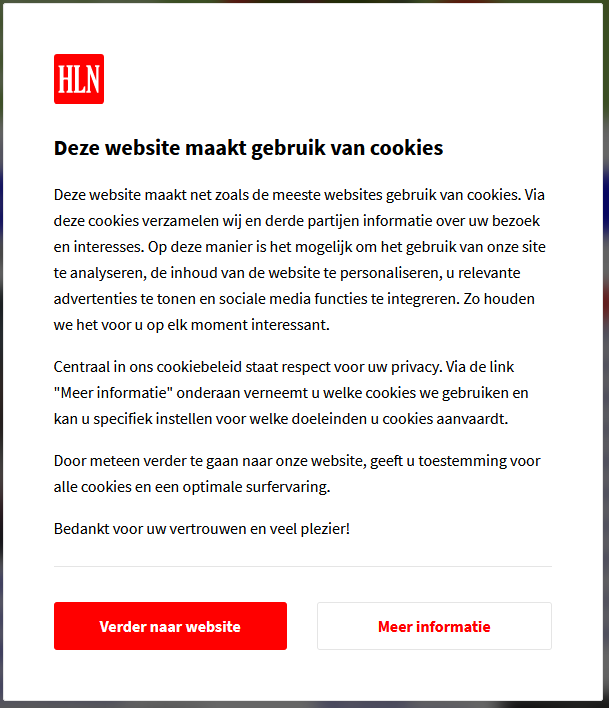
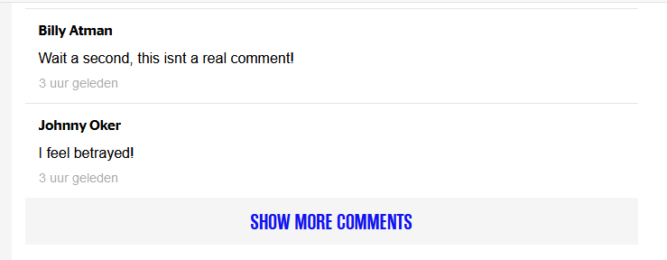
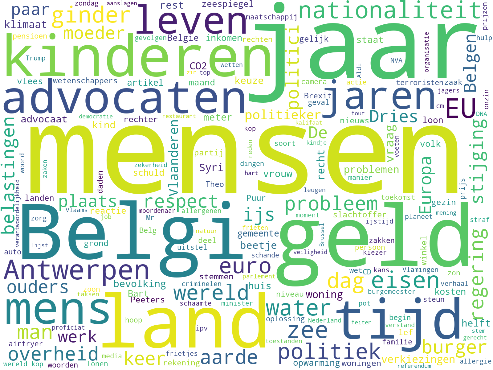
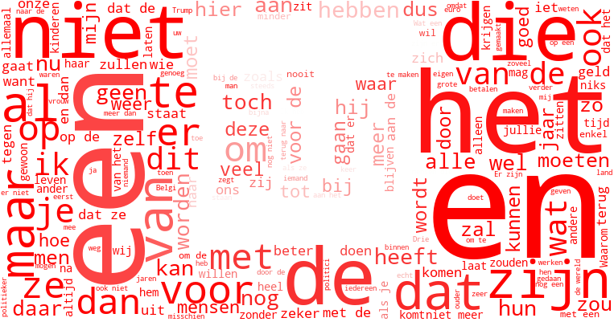

Title: From Webscraper to Wordcloud
Date: 2019-11-27 12:01
Category: Learning
Tags: Scraping, BeautifulSoup, NLP, SpaCy, WordCloud, python3.7, webscraping, data, cookiewall, error handling, ajax
Slug: guest-webscraper-to-wordcloud
Authors: Cedric Sambre
summary: After going through the web scraping learning paths, I decided to get my hands dirty and apply my freshly gathered knowledge on a real life project. I explain some difficulties you might encounter while scraping and I also show some libraries that can help you visualizing data you have obtained.  
cover: images/featured/pb-guest.png

Living in Belgium, I decided to scrape the Belgian newspaper [Het Laatste Nieuws](https://www.hln.be/).
I wanted to know what kept people busy when reading the news, so I went for a collection of all comments on all articles in the news section.

You can find the full code [here](https://github.com/xWhiteListed/trashpyle).

## Index
* [Requirements](#requirements)
* [The Little Scraper that could](#the-little-scraper-that-could)
    * [Bypassing The Cookiewall](#bypassing-the-cookiewall)
    * [Getting the articles](#getting-the-articles)
    * [The Comments, A new challenge](#the-comments-a-new-challenge)
* [A tiny bit of AI: SpaCy](#a-tiny-bit-of-ai-spacy)
* [Making things pretty: WordCloud](#making-things-pretty-wordcloud)
* [Things for the future](#future)

<a name="requirements"></a>
## Requirements 
* [Requests](https://pypi.org/project/requests/)
* [BeautifulSoup](https://pypi.org/project/beautifulsoup4/)
* [SpaCy](https://pypi.org/project/spacy/)
* [WordCloud](https://pypi.org/project/wordcloud/)
* [Numpy](https://pypi.org/project/numpy)

<a name="the-little-scraper-that-could"></a>
## The little Scraper that could
<a name="bypassing-the-cookiewall"></a>
### Bypassing the cookiewall
According to [cookielaw.org](https://www.cookielaw.org) the cookielaw can be described as following:
> The Cookie Law is a piece of privacy legislation that requires websites to get consent from visitors to store or retrieve any information on a computer, smartphone or tablet.
>
> It was designed to protect online privacy, by making consumers aware of how information about them is collected and used online, and give them a choice to allow it or not.

This means that if we haven't visited the page before, we will be greeted with a message that will block our access, asking for permission to put the cookies on our computer.



To get past this 'cookiewall', the server needs to be presented with a cookie, so it knows we have given consent and it can track us without legal implications.

I also set my user agent to the same as the one on my computer, so there would be no differences in the source presented to me based on what browser I was using.

```python
user_agent = 'Mozilla/5.0 (Macintosh; Intel Mac OS X 10_9_3) AppleWebKit/537.36 (KHTML, like Gecko) Chrome/35.0.1916.47 Safari/537.36'
consent_cookie = {'pws': 'functional|analytics|content_recommendation|targeted_advertising|social_media', 'pwv': '1'}
...
def get_pagedata():
    reqdata = req_session.get("https://www.hln.be/nieuws", cookies=consent_cookie, headers={'User-Agent': user_agent})
    return reqdata
```

Et voila! No more cookiewalls, let the scraping begin!

<a name="getting-the-articles"></a>
### Getting the articles
Now that I could get all the links, I had to go back to the HTML source of the page to figure out a good way to obtain the articles.
I ended up with a pretty conclusive piece of code for the time of writing, and also added a way to get the categories for the articles as labeled by HLN.

All these records were turned into `Article` namedtuples:

```python
Article = collections.namedtuple('Article', 'hash headline url categories')
```

```python
def get_all_articles(reqdata):
    soup = BeautifulSoup(reqdata.text, "html.parser")
    article_list = []
    html_article_list = soup.findChildren("article")

    for html_article in html_article_list:
        article_wrappers = html_article.findChildren("div")
        try:
            html_indiv_articles = article_wrappers[1].findChildren("a", {"class": "teaser-link--color"})
            for article in html_indiv_articles:
                article_link = article['href']
                categories = get_categories_from_article(article_link)
                article_title = article.findChild("h1").text
                if article_title is None:
                    article_title = article.find("h1")
                    if article_title is None:
                        exit(0)
                sha1 = hashlib.sha1()
                sha1.update(article_title.encode('utf-8'))
                article_hash = sha1.hexdigest()
                article_list.append(
                    Article(hash=article_hash, headline=article_title, url=article_link, categories=categories))
        except IndexError:
            # these are the divs from the most-read category, we should already have these.
            continue
```

I was pretty agressive on errorhandling by either `exit()`ing completely, or simply ignoring the exception and `continu`ing my loop, but that is because I feel scraping is a precise art and if data is something different than what you expect, you're expecting the wrong data!

Finally, I looped over the article list because I noticed that there were doubles (some articles might be on a 'featured' bar, and it was sometimes hard to distinguish between them)

```python
    clean_article_list = []
    [clean_article_list.append(itm) for itm in article_list if itm not in clean_article_list]
    return clean_article_list
```
<a name="the-comments-a-new-challenge"></a>
### The Comments, a new challenge

Now that I had a list of all articles and the links to them, I wanted to get started by getting all the comments when I noticed my first scraping run had only gotten me 2 or 3 per article.
Knowing there were 100's of comments on some of the articles in my article dataset, I realized something was wrong.

Back at the drawing board, we found the problem. A little thing called Ajax.

Every article loaded a couple of comments, and a link that said 'Show more comments'. 


When clicking this link, an Ajax call was made to get the next comments.
If there were more after that, a link was also included for the next ajax call.

The solution came with _regex_, as the Ajax links all were in a very specific pattern! 

Still, the recursiveness in the puzzle was a bit challenging.

```python
comment_regex = "href=\"(https\:\/\/www\.hln\.be\/ajax\/comments\/(.*?)\/start\/ts_\d*?)\">"
comment_rxobj = re.compile(comment_regex)

def get_comments_from_page(reqdata, article_hash):
    comment_list = []
    soup = BeautifulSoup(reqdata.text, 'html.parser')
    comments_list_ul = soup.find("ul", {"class": "comments__list"})
    if comments_list_ul is None:
        return comment_list
    comments_indiv_li = comments_list_ul.findChildren("li", {"class": "comment"})

    for comment in comments_indiv_li:
        comment_author = comment.find("h2", {"class": "comment__author"}).text
        comment_body = comment.find("p", {"class": "comment__body"}).text.replace("\n", " ").replace("\r", "")
        comment_list.append(Comment(article_hash=article_hash, commenter=comment_author, comment_text=comment_body))

    return comment_list

def get_all_comments(article_main_link, article_hash):
    comment_href_list = []
    comment_list = []

    article_reqdata = req_session.get(url=article_main_link, cookies=consent_cookie, headers={'User-Agent': user_agent})
    reqdata = article_reqdata
    comment_list += get_comments_from_page(reqdata=reqdata, article_hash=article_hash)

    while comment_rxobj.search(reqdata.text):
        comment_href_group = comment_rxobj.findall(reqdata.text)
        comment_href = comment_href_group[0][0]
        comment_href_list.append(comment_href)

        time.sleep(sleeptime)
        reqdata = req_session.get(comment_href, cookies=consent_cookie, headers={'User-Agent': user_agent})

        comment_list += get_comments_from_page(reqdata=reqdata, article_hash=article_hash)

    return comment_list
```

Because I didn't want to be sending too many requests in a short span, I also added some ratelimiting to not be too aggressive towards the hln server.

<a name="a-tiny-bit-of-ai-spacy"></a>
## A tiny bit of AI: SpaCy
If we want to know what people are talking about, we have to be able to recognize the different parts of a sentence.
If we would simply look at all words, a lot of 'non-descriptive' words would probably show up.
It would still give a good image, but a lot of space would probably be taken by stop words or conjunctions (like 'and')
  
What we really care about is the subjects people are talking about, the Nouns of the lines they write. That's where SpaCy comes in!

[SpaCy](https://spacy.io) is an open source library for Natural Language Processing.
There are trained models for a set of languages that can be used for [a lot of different things](https://spacy.io/usage/linguistic-features).

This allowed us to create a dictionary of 'types' of words:

```python
import spacy
nlp = spacy.load('nl_core_news_sm')
...
def get_wordtype_dict(raw_comment_list):
    wordtype_dict = defaultdict(list)
    for comment in raw_comment_list:
        doc = nlp(comment)
        for token in doc:
            wordtype_dict[token.pos_].append(token.text)

    return wordtype_dict
```

Outputting the first 5 words for each token:

```text
ADV:
    Eindelijk
    niet
    nu
    nog
    eens
    zo

PUNCT:
    !
    ...
    .
    .
    .
    .
PRON:
    Ik
    dat
    ik
    Ik
    Wat
    dat
VERB:
    ga
    kijken
    Kan
    wachten
    noem
    zie
NOUN:
    Hemels
    nieuws
    ziekte
    Pia
    leven
    toegewenst
```

The classification was not the most accurate but it was enough for what I wanted to do.

I plan on retraining the model with my new data in the future to hopefully get a more accurate model for Belgian comments with its dialects.

<a name="making-things-pretty-wordcloud"></a>
## Making things pretty: WordCloud
Now that I had the data, all I had to do was find a way to visualize it.
[Wordcloud](https://github.com/amueller/word_cloud) is a library designed to make... well, wordclouds!

The wordcloud library takes a blob of text, and takes turns them in to wordclouds with the size of the words reflecting the number of occurences.
After turning the lists of words in our worddict into strings, 2 lines of code were enough to produce a result:
```python
def make_word_cloud(text_blob):
    wordcloud = WordCloud(width=1600, height=1200, background_color="white").generate(text_blob)
    return wordcloud
```
For our nouns, this gave us:



You could also use a logo to generate the wordcloud by creating an `ImageColorGenerator()` and passing it to the wordcloud constructor:

```python
def make_word_cloud_logo(text_blob):
    rgb_hln_arr = np.array(load_hln_logo())
    wcig = ImageColorGenerator(rgb_hln_arr)
    wordcloud = WordCloud(width=1600, height=1200, background_color="white", mask=rgb_hln_arr, color_func=wcig)\
        .generate(text_blob)
    return wordcloud
```

For ALL the words, this resulted in:



<a name="future"></a>
## Things for the future
There's room for a lot of improvement in this project, below are some things I *really* want to get done and you might see me write about in the future:

* Improve the spacy model for dutch/belgian POS Tagging.

* This same project but with a more Object Oriented approach 

* Fix the encoding issues in the scraper

* Sentiment Analysis

* Merging word groups by combining POS Tagging and Dependency Parsing 

--

Thanks for reading, I hope you enjoyed it as much as I enjoyed writing it. 
If you have any remarks or questions, you can likely find me on the [Pybites Slack Channel](http://localhost:8000/pages/community.html) as 'Jarvis'.

Keep calm and code in Python!

-- [Cedric](pages/guests.html#cedricsambre)
