Title: Adding a guest article!
status: hidden

Hello Everybody!

I'll run through the procedure of using git and github to submit a guest article to PyBites.

### 1. Forking the Repository

In order to get started, you have to create a fork of the original repository.
A fork is a copy of a project to your own Github account.
 
This way, you can work on your own copy and ask the project maintainer to accept some modifications on your copy into the main repository.

Head over to the [PyBites blog Github repo](https://github.com/pybites/pybites.github.io-src/) and look for the Fork icon in the top right, I've marked it in green:

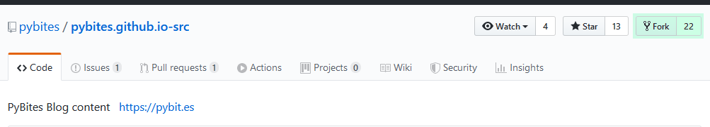

Git will start creating the copy, and when it's done, you'll have your very own pybites.github.io-src fork!

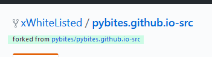

### 2. Cloning your copy

Now that we have our running fork, we can clone this from our own Github account. 

A clone is a local copy of a project from your Github to your local machine, where you can start editing!

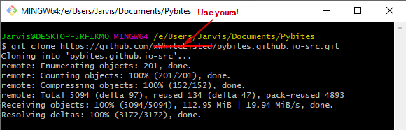

### 3. Preparing for the future

While you are making your edits or adding your article, the maintainers, or other contributors may be doing the same!
Git already knows of our origin, it knows where we cloned from. 

We also need to tell it what our upstream is, where did we fork from? Which is where the maintainers will be adding updates.

In this case that's https://github.com/pybites/pybites.github.io-src

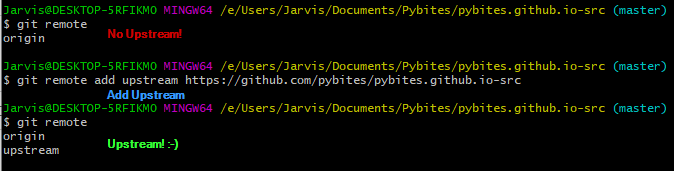

So now, if we want to get the maintainers latest modifications and add them to our own repository, we can first pull the upstream master branch, and then push it to our origin master branch!

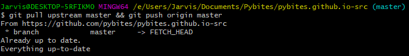

### 4. Before making modifications

The Gittiquette says that you should make a branch before starting any modifications.

A branch is a copy of our local copy at a certain point in time that will go on to live it's on life, and eventually (hopefully) rejoin with it's master somewhere down the road.

You can either create a branch while checking it out, or you can create a branch, and later switch to it with checkout.

You might want to set your branch name to something that you can recognize. Some trees have a lot of branches!

I'm currently writing this "how to add guest articles", so I'll give mine an obvious name:

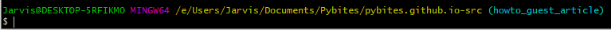

Branching is mainly important when you want to verify that your new modifications are not conflicting with any new changes in the upstream.
Some more about this later when we'll need it!

### 5. Writing your article

**Post directory and style**

Guest articles are stored in [content](https://github.com/pybites/pybites.github.io-src/tree/master/content), are written in markdown and usually start with **guest-**

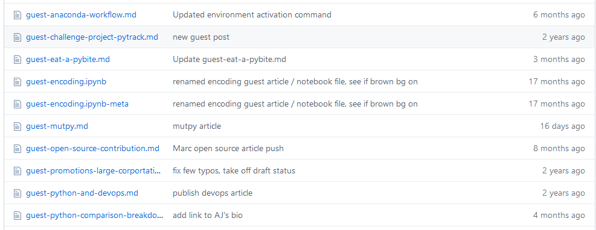

I've added a template you can use [here](https://github.com/pybites/pybites.github.io-src/content/templates)

It contains the structure of most articles and some basic markdown syntax as example, [here]'s another cheat sheet for if you want to do even more!

You can also look at the other articles as an example.

**Adding images**

If you have images you want to add (screenshots, infographics,...), you can add them under `content/images/` and refer to them in your article like this:

``

**A new guest!**

If this is your first article, you should also add a small bio in content/pages/guests.md, right above the comment:

`<!-- insert your new bio above this line -->`

You can copy copy one from the guests file yourself, or use the [template](https://github.com/pybites/pybites.github.io-src/tree/master/content/templates) for the bio. 

### 6. Adding and commiting your changes

Commit's are collections of small changes you have made. Adding your article could probably go in a single commit.
You're going to tell git that you've changed or added a bunch of files first:

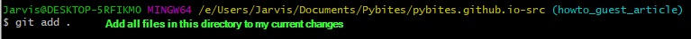

...and then you're gonna store these changes in a commit:

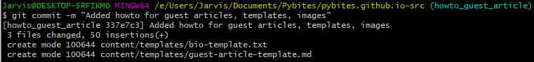

I still have some work to do, but when you're ready, you can push your modified branch back to the branch on it's origin you've created for the modifications:

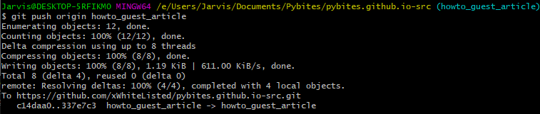

And you're all set!

If you're logged in and you go to the upstream github page, you'll notice github automatically detects you've pushed a branch that was related to this project!

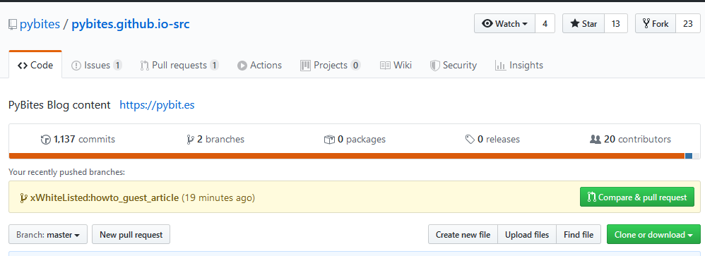

And you can create a pull request, which effectively asks the maintainer to pull the changes you've made into the master branch.

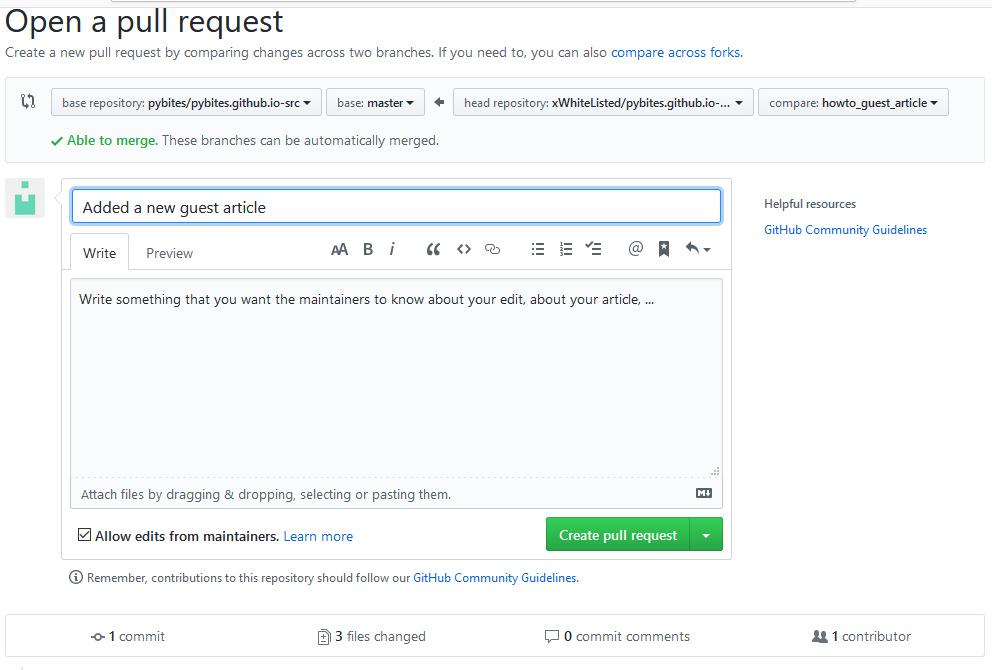

Now all you have to do is wait for someone to review your changes and if they are approved, your article will soon be ours to read on the PyBites blog!

